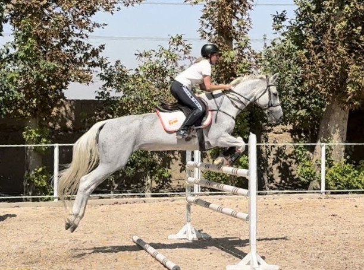

# About

I’m Maryam Shojaei, a designer passionate about creating meaningful designs that blend aesthetics, functionality, and sustainability. My work focuses on tackling social and environmental challenges through thoughtful, human-centered design.
Currently, I am pursuing my Master’s degree at IAAC (Institute for Advanced Architecture of Catalonia) in Barcelona, where I explore innovative approaches to design and technology integration. My background includes experience in product, interior, packaging, and visual design, with a strong emphasis on design thinking and sustainable practices.
I believe design has the power to transform how we live and interact with the world — not only by solving problems but by inspiring a more conscious and creative future. As a female entrepreneur and designer, I aim to bring empathy, precision, and purpose into every project I take on, from concept to execution.
Beyond design, I am also a professional show jumping rider, deeply passionate about equestrian sports. I hope to one day merge these two worlds — combining my love for horses with my design expertise — to contribute meaningfully to the development of innovative and human-centered solutions in the equestrian field. For me, design is more than a profession; it’s a way to connect people, nature, and innovation in harmony.

