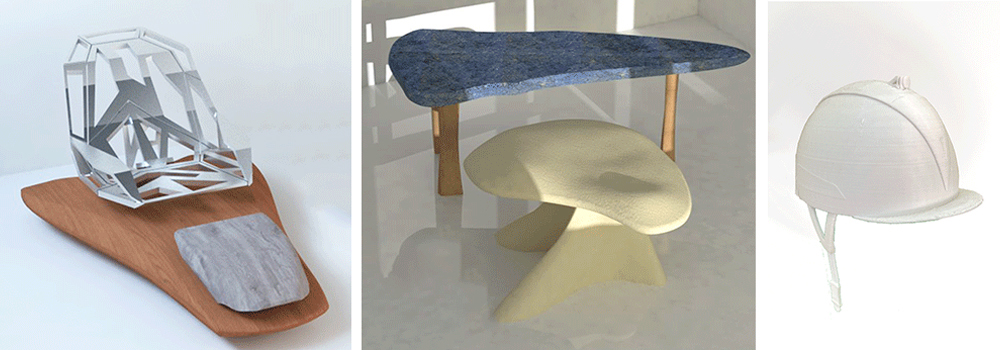

## Welcome

I’m Maryam Shojaei, a product designer currently studying at IAAC. My work focuses on exploring how design connects functionality, emotion, and human experience. This website presents an overview of my design journey from initial concepts and sketches to developed projects and tangible outcomes. Each project reflects my interest in understanding how ideas evolve through material, form, and interaction. I see design as a continuous process of learning, questioning, and creating meaningful solutions. You’re invited to explore my projects and discover the thoughts, processes, and inspirations that shape my approach to design.

In the Projects section, you can explore my academic and personal works, starting from my first-term projects at IAAC. Each project reflects a step in my growth as a designer — from experimentation and research to hands-on prototyping. Together, they represent my ongoing exploration of form, material, and meaning. Feel free to explore, discover connections, and see how my ideas continue to evolve through design.