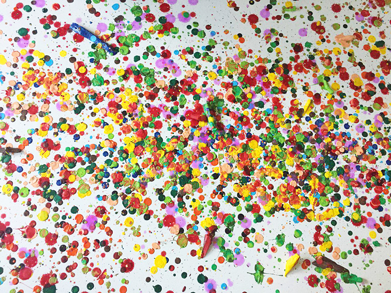

---
hide:
    - toc
---

# Initial ideas

Initial Ideas represents the earliest stage of my design process — a space where intuition meets curiosity. These concepts are not final answers, but explorations that question how we relate to materials, technology, and our surroundings. Each idea begins with an observation, a thought, or a feeling that gradually transforms into form and function. Through sketches, models, and experiments, I seek to translate emotions into tangible expressions, shaping a dialogue between imagination and reality — the foundation of every design I create.

