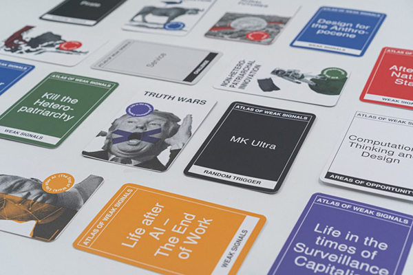
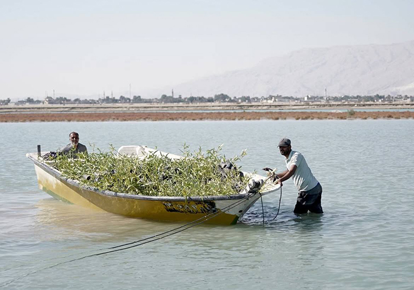
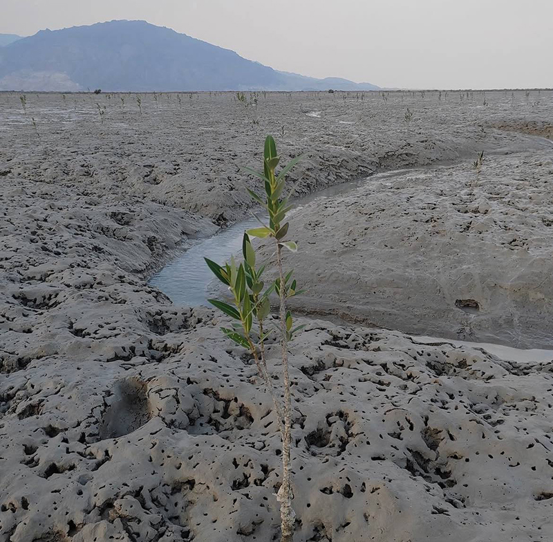

---
hide:
    - toc
---

# Design Studio 0
Atlas of Weak Signals
Atlas of Weak Signals explores subtle emerging patterns that reveal possible directions for our collective future. These signals highlight early signs of environmental, social, and technological change that may later shape global challenges. By studying them, we aim to understand how design can respond with awareness and resilience. Rather than predicting the future, our approach focuses on adaptability and coexistence — using design as a tool to imagine responsible, inclusive, and sustainable ways of living in an ever-changing world.

# creator or destroyer?
There are two different dimensions within every human being: one of creation and one of destruction. Every person carries both aspects in their life, though sometimes they become fully aware of them. In rare, profound moments, a person may notice the consequences of their own destructive actions and consciously choose to create something meaningful instead. Many of the salvations and positive changes we have experienced in life have arisen from such moments of awareness. Yet, life is unpredictable. In the very next moment, the same person might make a choice that is careless or harmful — they might indulge in fast fashion, contributing to environmental damage, or, from a broader perspective, even make decisions that devastate entire cities. Despite this, I have sought to embrace the creative dimension in my own way. In Bandar Khamir, on Qeshm Island, I planted trees for the Earth, nurturing life in a fragile environment. This act of planting reminded me of the resilience of nature: even from the heart of destruction, life can emerge. It is much like the mangrove trees I planted that sprouted in my brother’s mind, symbolizing hope, regeneration, and the enduring power of creation amidst destruction.

# Inner Consciousness
This piece, in the very fabric of its being, has a story woven into its threads — a story that perhaps we don’t fully know, whose secrets are hidden. When I got closer, I noticed how tiny words were written across the fabric. Isn’t that fascinating? Like our subconscious mind, we may not even know its secrets ourselves, but when we look inward and explore, we become aware and discover things about ourselves. I had been having strange dreams for a while — about Rome, about a warrior woman in Rome fighting for her city with all her heart. Later, I realized that perhaps it was part of a past life. What story was hidden in it? How does it connect to my current life? Did understanding it help me? The answer is yes. I realized I have knots in this life that stem from the past, and I tried to resolve them. Because I resolved them, I am here now. Before this, interestingly, my plans to come to Spain wouldn’t work — something always blocked them. But after I resolved and reconciled with myself and that part of me, I was able to enter a new chapter of my life. And the most important principle for the future of humanity is awareness: awareness of our inner self, awareness of ourselves, and awareness of the world.

# Humanity as Patience
Just as one must wait patiently while fishing to catch a fish, in nature, one must also be patient to witness a phenomenon or to see a living creature, an animal, or a particular species. Perhaps one of our problems as humans is that we have become a bit impatient. Modern life, mobile phones, and the internet have all contributed to this impatience, because everything now comes so quickly. Yet nature preserves its own rhythm. That is why, whenever humans return to nature, they learn not to forget their essence, to avoid greed, to be patient, kind, and to embrace many other lessons that nature teaches. Nature guides us inward, toward self-awareness. Perhaps if the world’s political leaders were also more aware of themselves, they would learn patience. They might understand that on this tiny planet, we humans are the smallest particles in the vastness of galaxies, and that war serves no purpose other than exhausting ourselves and depleting our resources. Perhaps if I hadn’t walked all that way, I would not have seen that beautiful yellow butterfly — just as I patiently waited from seven in the morning until five in the afternoon with my uncle to catch a fish.

