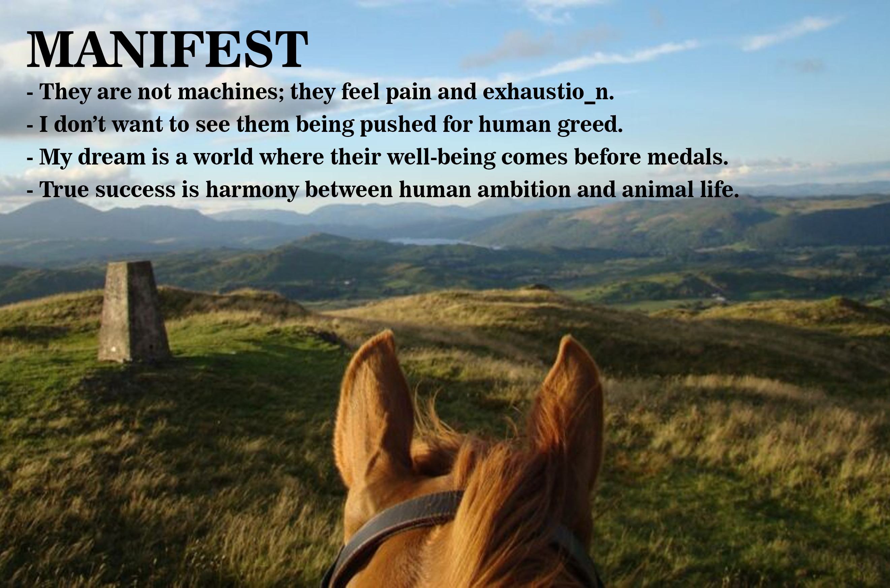

---
hide:
    - toc
---

# Design Studio 1: Project Overview

# ACT01-Context
In Design Studio 1, we were asked to select a topic aligned with our personal interests. Since I cannot set aside my passion for horses, I chose a topic based on the challenges that arise from excessive pressure on show-jumping horses. This pressure is not always purely physical; mental stress can also significantly affect the horse, sometimes causing trauma.

Trainers often push horses to perform flawlessly in competitions or to improve their own rankings among riders. This frequently involves heavy competition schedules, which can lead to both physical injuries and mental strain for the horse over time. It is important to acknowledge that horses deserve a normal life, and humans should not treat them merely as tools to achieve personal goals, such as high scores in competitions. Horses, like any living beings, can experience fatigue, and our use of them as instruments for human ambition does not align with their natural needs.

To explore this subject in depth, I conducted research in several areas. I gathered insights from trainers and active equestrians, studied the historical role of horses in human society, examined equestrian competitions, and investigated horse body language. The following video showcases some of my research in this field.

  <iframe 
    src="https://www.youtube.com/embed/kZ7hefoiWoE" 
    frameborder="0" 
    allow="accelerometer; autoplay; clipboard-write; encrypted-media; gyroscope; picture-in-picture" 
    allowfullscreen
    style="position: absolute; top:0; left: 0; width: 100%; height: 100%;">
  </iframe>

# why? 
The goal of this first action was to understand how and why horses face physical and emotional pressure during training and competitions. This topic is closely linked to actual practices in the equestrian industry. For this reason, it was important to gather insights from professionals who work with horses every day. Seeing the problem from their viewpoint helps pinpoint where the pressure comes from and how it becomes accepted in competitive environments.

# WHERE?

This study was carried out in both physical and virtual settings.
Internet searches, scholarly and informal sources, and online interviews with qualified riding instructors and trainers via WhatsApp were all part of the online research.
Concurrently, field research was conducted at equestrian clubs and riding centers, where I personally visited (in Reial Club de Polo de Barcelona) and had direct conversations with riders, trainers, stable staff, and veterinarians. These in-person discussions offered firsthand insights and observations about the training, pressure, and management of horses in competitive settings.

# How?
To better understand this topic, I used a mix of research approaches. I started by exploring information online, looking into how horses have evolved over time, their physical traits, and how they respond to work and stress. This gave me a broader perspective on horses, not just as competitive animals, but as living beings with unique histories and sensitivities.

I connected with experienced riding instructors and trainers, especially those working at high levels. I reached out to them through WhatsApp interviews, asking them directly about their experiences. My questions focused on:
How pressure is applied to horses during both training and competitions
The impact of performance expectations on horses, both physically and mentally
The current methods and strategies they use to reduce or manage this pressure
By combining these research methods, I was able to gather both scientific background and real-world insights from professionals in the field.

# Manifesto

# ACT02-Prototype an Action

# Project Focus

This project examines the complex relationship between humans and horses—a relationship that oscillates between love, dominance, and sometimes competition. On the surface, this relationship appears as trust and coordination between two bodies, but beneath it lies pressure, inequality, and misunderstanding. The setting is not necessarily limited to an arena; any environment can serve as a platform for reflecting on this relationship.

Layer One: Pressure from the Scoring System
In equestrian competitions, each point represents success for humans, but for horses, it can signify fatigue, strain, or even injury. To achieve higher scores, riders often push horses beyond their limits, causing physical exhaustion. This project aims to reveal this hidden cycle: a visual representation shows a score table on a monitor alongside a human whose body becomes progressively more fatigued and worn with each point—symbolizing the horse’s physical and emotional burden. The human body becomes a metaphor for the horse’s body, carrying effort, pain, and obedience simultaneously.

Layer Two: Freedom and Choice for Horses
The project questions the autonomy of horses: Are they truly at ease? Do they choose humans consciously? Would they be freer in open fields, experiencing wind and earth, rather than confined to a three-meter stall? Horses are typically taken out of their stalls only for training or competitions, spending most of their time waiting for scheduled feeding. In the best case, their enjoyment is limited to finding a carrot or receiving a small reward. This enforced stillness reflects a life where freedom becomes discipline, and joy becomes duty.

Layer Three: Miscommunication Between Humans and Horses
Humans cannot fully understand horse language, just as horses do not fully understand ours. Yet, we communicate through body language, sound, tone, gaze, and movement. Inspired by this, I designed an exercise in which two humans, who do not share a spoken language, interact using only voice, tone, gestures, and body posture. They then explain what they understood from each other. This experience mirrors the human-horse relationship, where words are absent and only perception, attention, and signals remain—similar to a horse silently asking for something through its gaze or ear movements, leaving us to interpret.

# Conceptual defenition
This project explores the human–horse relationship by placing the human body inside a racehorse’s daily routine. For 12 hours, the performer lived in a confined space, engaging in eating, waiting, resting, and performing a repetitive “competition.” The experience aimed to replicate aspects of a horse’s exhaustion, limited freedom, and the continuous pressures they face — knowing that for horses, this is not a temporary 12-hour experience, but a routine endured over years. The project investigates the ethical, emotional, and physical dimensions of equestrian practices, highlighting the anthropocentric approach where the horse’s agency is often secondary to human scoring and performance goals. Objectives include developing bodily empathy, revealing structural inequalities, prompting ethical reflection on riding practices, and encouraging a shift from domination to coexistence.

# Potentials for Change

Reveal Hidden Inequalities – Challenge the mechanical, score-focused approach in equestrian competitions and encourage a redefinition of success.

Foster Physical Empathy – Allow the audience to not just see but feel the pressure, fatigue, and expectations from the horse’s perspective.

Redefine Human-Animal Relationships – Shift from dominance to understanding, respect, and coexistence.

Encourage Ethical Reflection and Behavior Change – Invite reflection through body language and emotion rather than judgment.

Promote Cross-Species Communication – Highlight that understanding can occur through observation, touch, and silence beyond verbal language.

# Measurable Goals

Audience empathy and discomfort

Awareness of overlooked limitations

Observable physical reactions

Change in perspective toward animals

Lasting emotional memory

# Hypotheses

01. Experiencing the horse’s condition in a competition:

Focused on observing and understanding what a horse endures during competitions: stress, pressure, and physical limitations.

02. Research on the body language of horses
Explored how beings without a shared language communicate through body language; initial tests conducted, further development needed.

03. Experiencing the confined living space of a horse stall
Involved staying in a small space for several hours to simulate the psychological and physical pressures caused by restricted movement.

04. Simulating the pain caused by control and disciplinary tools
Focused on representing the effects of whips and spurs on the horse’s body, understanding discomfort and pain levels inflicted.

05. Role reversal: the human as the horse
Involved adopting the horse’s role and carrying humans on the back, to physically and mentally experience the burden horses endure.

# Type of Action

The main action of the project combines resistance, protest, and invitation to reform:

Resistance – Against instrumental and score-focused treatment of animals, simulating human exhaustion as a metaphor for the horse’s body.

Protest – Visual and emotional demonstration of unfair systems that ignore animal well-being.

Invitation to Reform – Engaging audiences empathetically, encouraging reflection without violence or blame.

The experience can be presented in three stations:

Scores and Fatigue Display – A monitor shows scores while a human body becomes progressively exhausted, symbolizing the horse’s strain.

Confined Three-Meter Space – A controlled environment with intermittent sounds and silence to create a sense of waiting and limitation.

# Practical Experiment

To fully understand my topic, I combined layers one and two by simulating the life of a show-jumping horse. I created a scenario to experience life in a small stall for 12 hours, simulating the confinement and conditions of competition. I observed behaviors I could emulate to gain a better understanding of the horse’s experience. Despite my asthma and heart condition, I pushed myself as far as possible to execute this hypothesis.

  <iframe 
    src="https://www.youtube.com/embed/SHC8dRvq8gA" 
    frameborder="0" 
    allow="accelerometer; autoplay; clipboard-write; encrypted-media; gyroscope; picture-in-picture" 
    allowfullscreen
    style="position: absolute; top:0; left: 0; width: 100%; height: 100%;">
  </iframe>

The final prototype integrates multiple hypotheses into a single long-duration performance. For 12 hours, the performer experienced:
1. Confinement to a small space (stall simulation)
2. Repetitive physical competition: running back and forth, scoring every 6 laps, repeated 16 times
3. Communicating from a distance
4. Management of boredom, waiting, resting, and limited social interaction
5. Fatigue and bodily pressure consistent with horse experience

# Critical Evaluation & Contextual Relationship
 
 12 hours of confinement were physically and mentally exhausting.
Horses endure such restriction continuously for years.
Being forced into small stalls causes boredom, frustration, and stress.
Performer experienced restlessness, irritability, and mental fatigue — a glimpse of the horse’s daily reality.
Competition segment (running on sand with asthma) caused chest pain and extreme fatigue.
Highlights how horses are pushed to perform despite discomfort, prioritizing human scoring systems.
Limited communication shows how subtle equine signals are often misinterpreted.
When results and obedience dominate, relationships shift from coexistence to control.
Prototype reveals hidden labor, loss of agency, and ethical concerns in equestrian sports.
Encourages audiences to reconsider practices and imagine more empathetic, horse-centered futures.

# Insights from Interviews and Observations

Through interviews with riders and trainers, I identified key factors for preparing horses for competitions with less stress and more readiness:
Specifying rest, training, and training type for each horse.

Avoiding tasks beyond the horse’s capability, understanding its physical limits, and knowing suitable jump heights.

Considering veterinarians, nutrition, environment, medication, and post-training care such as massage and ice therapy.

Ensuring harmony between horse and rider, built through shared time and mutual understanding.

Recognizing that humans cannot fully interpret horse language; we rely on posture and body language to approximate meaning, similar to communicating with someone who speaks a different language.

This reflection emphasizes the importance of empathy, awareness, and adaptation in fostering a healthier, more ethical relationship between humans and horses.

# ACT03-Act Individually

## Conceptual Statement
This research examines the human-horse relationship system formed by competition, performance, and the money factor. I acted as a single person, and my presence was in the places where horses live—training, stables, competition, and also the betting that is linked to horse riding.
The first step does not present any solution but aims at revealing the hidden power structures around the horses, physical training routines, psychological expectations, and financial motivations such as betting included. The project is challenging an anthropocentric system that considers horses merely as tools for human ambition, entertainment, and profit.

# Action Strategy
My action strategy is grounded in embodied research, firsthand observation, and participation. 
I purposely put myself in places where pressure is created and accepted ranges—from equestrian clubs and training sessions to betting areas such as casinos. Through talks, watching, and personal taking part, I learned how competition, risk, and money make treatment and overexertion of horses indirect.

# Protocols
01. Conduct online research on horse injuries, overtraining, and equestrian competition systems.
02. Visit equestrian clubs and observe training sessions and stable routines in person.
03. Engage in conversations with riders, trainers, and stable workers.
04. Interview professional trainers via WhatsApp (online).
05. Investigate betting culture related to horses by visiting a casino and speaking with people involved in gambling activities.
06. Participate directly by placing a bet (roulette) to experience the emotional and psychological mechanisms of risk and reward.
07. Document all observations through notes, photographs, sketches, and reflective writing.

# ACT04-Act Collectively

# Conceptual Statement

This concerted effort is coming from a necessity to uncover the system that is fundamentally damaging to horses. The project, instead of looking for a single culprit, rather demonstrated how the combination of the competitive equestrian sports and betting economies is the cause of physical and psychological damage to the non-human bodies.

Gambling and equestrianism, in their full-blown forms, are being brought together in this action, thereby making it clear that horses are part of a profit-oriented system where risk, loss, and exhaustion are accepted as a matter of course. The horse is not portrayed as an alone victim, but as a living body that is constantly influenced and affected by the coming together of human pleasures, entertainment, and economic profits.

# Process Documentation & Methodology

The process was documented through a structured audiovisual methodology that captures escalation, tension, and consequence:
1. Contextual documentation of casino and riding environments
2. Temporal synchronization between betting mechanics and horse movement
3. Voice-over integration of factual data to expose scale and impact
4. Sequential documentation reflecting anticipation, climax, and loss

Documentation functions as a critical tool, transforming individual experience into collective awareness.

# Acion Strategy
The action strategy was based on direct immersion within the gambling collective and embodied participation in equestrian activity. I went purposely into the casino atmosphere, interacted with bettors, understood gambling's rules and logic, and took part in it actively.

In parallel, I put myself on horseback in a physically and emotionally risky situation. The strategy demonstrates how human emotional systems are transferred onto animal bodies by experiencing risk, anticipation, and loss within the betting collective and translating these states into the horse's faster movement and fatigue. 

# Protocol phases
Phase 1 – Collective Observation
1. Visiting a casino and observing betting behaviors related to horses and roulette
2. Speaking with individuals involved in gambling, both locally and through online conversations (including Iranian contexts)

Phase 2 – Learning the System
1. Learning betting rules, strategies, and decision-making logic
2. Understanding how value, chance, and loss are constructed

Phase 3—Participation and Risk
1. Actively placing a bet
2. Experiencing stress, anticipation, and loss as part of the collective

Phase 4—Parallel Embodiment
1. Riding a horse in an uncontrolled natural environment
2. Increasing speed in parallel with the spinning roulette
3. Translating betting loss into physical fatigue, sweat, and exhaustion of the horse

Phase 5—Experiencing Fatigue and Loss
1. Experiencing actual physical fatigue and exhaustion of the horse during riding
2. Experiencing emotional tension and loss from betting
3. Observing the direct correlation between the horse’s stress and human emotional states

Phase 6—Systemic Exposure and Disclosure
1. Integrating factual data on horse betting, injuries, and deaths
2. Connecting personal experience to large-scale economic and ethical consequences
3. Revealing and making visible the systemic harm produced by human practices

# Activation of an Affective Relationship to a Collective of Interest
Gamblers, betting environments, riders, horses, and the economic systems surrounding competition are all part of the collective involved in this action. I deliberately treated the collective as an active interaction field and not as a passive subject.

I was affected by the system directly through my learning, participation, and emotional engagement with the community. This mutual exposure creates an affective relationship in which the collective is not seen from afar but is felt from inside. The project reveals the daily participation that keeps alive the system that harms non-human lives.

The main aim of the collective is to put to the fore the shared responsibility that is hidden in this system.

  <iframe 
    src="https://www.youtube.com/embed/lN1W13td15Y" 
    frameborder="0" 
    allow="accelerometer; autoplay; clipboard-write; encrypted-media; gyroscope; picture-in-picture" 
    allowfullscreen
    style="position: absolute; top:0; left: 0; width: 100%; height: 100%;">
  </iframe>

# Artifact

- The pain behind The Race

This project is a game-based art artifact designed as an act of protest and awareness against horse race betting and the hidden violence embedded in it.
Instead of presenting betting as entertainment, the game exposes how every act of winning, prediction, and profit is directly tied to physical harm inflicted on a living body.
The game uses the familiar language of board games—numbers, tokens, movement, and chance—to invite players in. However, as the game progresses, it becomes increasingly uncomfortable. What initially feels like strategy and luck slowly reveals itself as collective responsibility for suffering.

- Core Concept

At the center of the board lies a single horse.
There are no individual horses for each player—only one shared body.

Each time a player wins a betting round, a blood token (a symbol of pain and injury) is placed on the horse’s body. With repeated wins, the horse gradually becomes covered in marks of damage. The horse never benefits from victory. It only absorbs the consequences.

The game intentionally creates a contradiction:
- the more successful the players are, the more injured the horse becomes.

- The Golden Squares: Systemic “Solutions”

The board is designed as a race track, and along the path there are four Golden Squares.
When a player’s piece lands on one of these squares, the game temporarily shifts from betting to what appears to be “care” or “management.”
At this moment, the player must draw one intervention card, representing institutions and roles that are commonly used to justify or normalize horse racing and betting.
These cards may reduce visible harm, but they never stop the system itself.

- The Four Cards:

1. Health Insurance
Remove one blood token.

2. Veterinarian
Remove one blood token, but skip one round.

3. Horse Owner
Swap your horse with another horse, including all its blood tokens.

4. rainer
Spin the wheel twice.

Each card offers a form of relief, delay, or displacement—but never true care.
Pain is hidden, postponed, transferred, or intensified, yet the race continues.

- Meaning and Intention

The Golden Squares are not rewards.
They represent systemic tools that make exploitation sustainable.

Insurance does not heal.
Veterinary care keeps the horse functional.
Ownership turns suffering into a transferable asset.
Training increases pressure in the name of performance.

Through play, participants come to understand that betting does not merely predict outcomes—it demands endurance from a body that cannot consent.

- Additional Rule and Interpretation

Although the game exposes harm, it also introduces a misleading sense of protection.

A player may remove more blood tokens from the horse’s body than others. On the surface, this player appears to be the one who “protected” the horse the most. According to the game’s rules, this player is declared the winner.

However, this victory is intentionally problematic.
The act of removing blood does not stop the system that produces injury—it only manages its appearance. The winner is not the one who saved the horse, but the one who was most successful at operating within the same harmful structure.

This rule reflects how, in real betting systems, individuals or institutions can be celebrated as protectors while remaining fully dependent on the exploitation they claim to reduce.

- Final Gesture

By the end of the game, when the horse’s body can no longer absorb more damage, one player is forced to perform a final action that breaks the illusion of play and connects the game to reality: a symbolic vote against horse betting.

The game ends not with celebration, but with accountability.

<iframe width="560" height="315"
    src="https://www.youtube.com/embed/g0yh1uotPvo"
    title="YouTube video player"
    frameborder="0"
    allow="accelerometer; autoplay; clipboard-write; encrypted-media; gyroscope; picture-in-picture"
    allowfullscreen>
</iframe>

