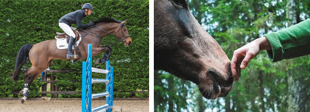

---
hide:
    - toc
---

# Design Studio 1: Project Overview

In Design Studio 1, we were asked to select a topic aligned with our personal interests. Since I cannot set aside my passion for horses, I chose a topic based on the challenges that arise from excessive pressure on show-jumping horses. This pressure is not always purely physical; mental stress can also significantly affect the horse, sometimes causing trauma.

Trainers often push horses to perform flawlessly in competitions or to improve their own rankings among riders. This frequently involves heavy competition schedules, which can lead to both physical injuries and mental strain for the horse over time. It is important to acknowledge that horses deserve a normal life, and humans should not treat them merely as tools to achieve personal goals, such as high scores in competitions. Horses, like any living beings, can experience fatigue, and our use of them as instruments for human ambition does not align with their natural needs.

To explore this subject in depth, I conducted research in several areas. I gathered insights from trainers and active equestrians, studied the historical role of horses in human society, examined equestrian competitions, and investigated horse body language. The following video showcases some of my research in this field.

<iframe width="560" height="315"
src="https://www.youtube.com/embed/fgL8Ha70psY"
title="YouTube video player" frameborder="0"
allow="accelerometer; autoplay; clipboard-write; encrypted-media; gyroscope; picture-in-picture"
allowfullscreen>
</iframe>

# Project Focus

This project examines the complex relationship between humans and horses—a relationship that oscillates between love, dominance, and sometimes competition. On the surface, this relationship appears as trust and coordination between two bodies, but beneath it lies pressure, inequality, and misunderstanding. The setting is not necessarily limited to an arena; any environment can serve as a platform for reflecting on this relationship.

Layer One: Pressure from the Scoring System
In equestrian competitions, each point represents success for humans, but for horses, it can signify fatigue, strain, or even injury. To achieve higher scores, riders often push horses beyond their limits, causing physical exhaustion. This project aims to reveal this hidden cycle: a visual representation shows a score table on a monitor alongside a human whose body becomes progressively more fatigued and worn with each point—symbolizing the horse’s physical and emotional burden. The human body becomes a metaphor for the horse’s body, carrying effort, pain, and obedience simultaneously.

Layer Two: Freedom and Choice for Horses
The project questions the autonomy of horses: Are they truly at ease? Do they choose humans consciously? Would they be freer in open fields, experiencing wind and earth, rather than confined to a three-meter stall? Horses are typically taken out of their stalls only for training or competitions, spending most of their time waiting for scheduled feeding. In the best case, their enjoyment is limited to finding a carrot or receiving a small reward. This enforced stillness reflects a life where freedom becomes discipline, and joy becomes duty.

Layer Three: Miscommunication Between Humans and Horses
Humans cannot fully understand horse language, just as horses do not fully understand ours. Yet, we communicate through body language, sound, tone, gaze, and movement. Inspired by this, I designed an exercise in which two humans, who do not share a spoken language, interact using only voice, tone, gestures, and body posture. They then explain what they understood from each other. This experience mirrors the human-horse relationship, where words are absent and only perception, attention, and signals remain—similar to a horse silently asking for something through its gaze or ear movements, leaving us to interpret.

# Potential Impacts of the Project

Reveal Hidden Inequalities – Challenge the mechanical, score-focused approach in equestrian competitions and encourage a redefinition of success.

Foster Physical Empathy – Allow the audience to not just see but feel the pressure, fatigue, and expectations from the horse’s perspective.

Redefine Human-Animal Relationships – Shift from dominance to understanding, respect, and coexistence.

Encourage Ethical Reflection and Behavior Change – Invite reflection through body language and emotion rather than judgment.

Promote Cross-Species Communication – Highlight that understanding can occur through observation, touch, and silence beyond verbal language.

# Measurable Objectives

Experience Empathy – At least 70% of participants report feeling fatigue, limitation, or empathy with the horse (via forms or discussion).

Critical Understanding – Participants can identify and discuss one unfair or overlooked practice in equestrian sports.

Attitude Change – At least half of participants express willingness to reconsider the human-animal relationship.

Observable Physical Reactions – Record changes in body language (movement speed, posture, gestures) during various parts of the experience. 
Long-Term Recall – Participants recall the core emotional experience in follow-up discussions days later.

# Type of Action

The main action of the project combines resistance, protest, and invitation to reform:

Resistance – Against instrumental and score-focused treatment of animals, simulating human exhaustion as a metaphor for the horse’s body.

Protest – Visual and emotional demonstration of unfair systems that ignore animal well-being.

Invitation to Reform – Engaging audiences empathetically, encouraging reflection without violence or blame.

The experience can be presented in three stations:

Scores and Fatigue Display – A monitor shows scores while a human body becomes progressively exhausted, symbolizing the horse’s strain.

Confined Three-Meter Space – A controlled environment with intermittent sounds and silence to create a sense of waiting and limitation.

# Practical Experiment

To fully understand my topic, I combined layers one and two by simulating the life of a show-jumping horse. I created a scenario to experience life in a small stall for 12 hours, simulating the confinement and conditions of competition. I observed behaviors I could emulate to gain a better understanding of the horse’s experience. Despite my asthma and heart condition, I pushed myself as far as possible to execute this hypothesis.

(Video of the performed action)

# Insights from Interviews and Observations

Through interviews with riders and trainers, I identified key factors for preparing horses for competitions with less stress and more readiness:
Specifying rest, training, and training type for each horse.

Avoiding tasks beyond the horse’s capability, understanding its physical limits, and knowing suitable jump heights.

Considering veterinarians, nutrition, environment, medication, and post-training care such as massage and ice therapy.

Ensuring harmony between horse and rider, built through shared time and mutual understanding.

Recognizing that humans cannot fully interpret horse language; we rely on posture and body language to approximate meaning, similar to communicating with someone who speaks a different language.

This reflection emphasizes the importance of empathy, awareness, and adaptation in fostering a healthier, more ethical relationship between humans and horses.