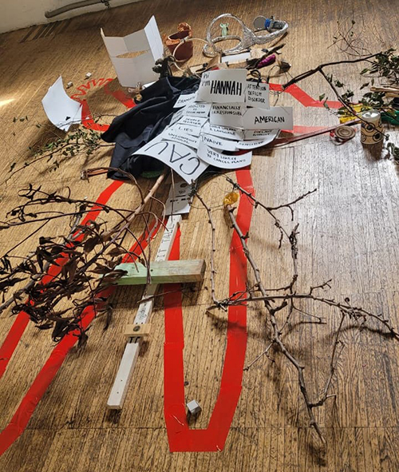
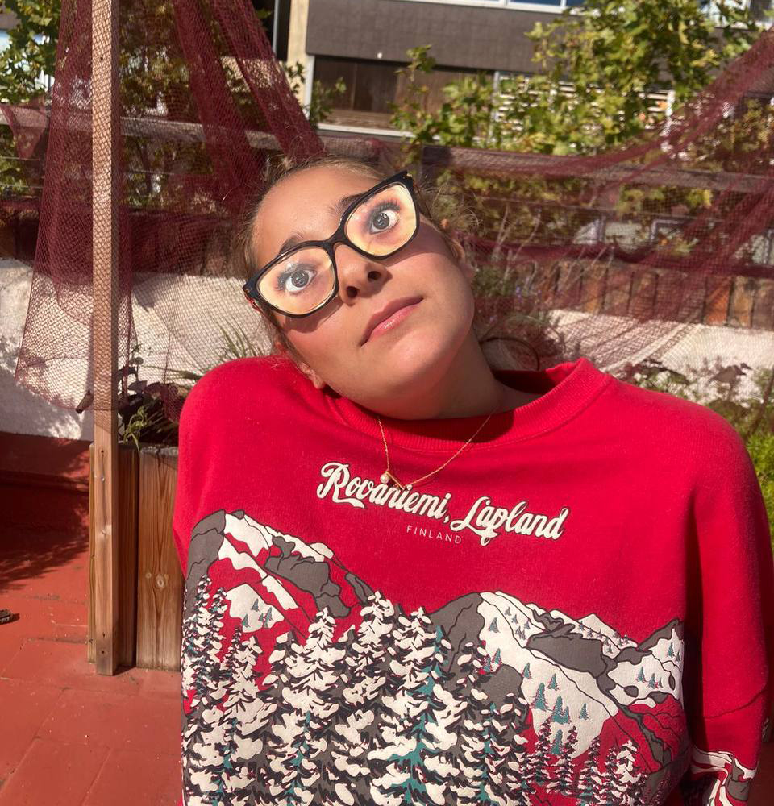
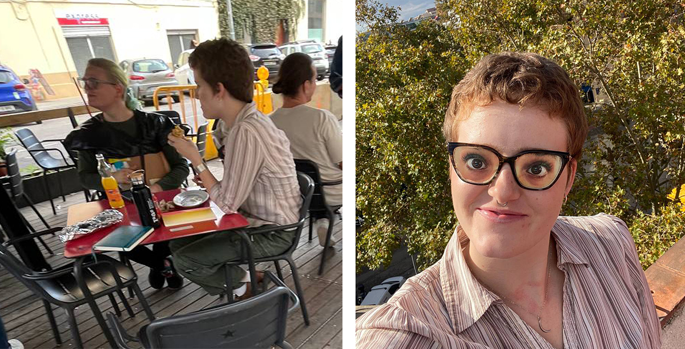

---
hide:
    - toc
---

# Reflection 1

living with our own idea

# Overview of the Course
In this course, we learned to engage more deeply with ideas related to ourselves and our personal lives. We explored how we might improve and elevate ourselves by using our abilities and various tools, ultimately becoming better versions of who we are. In the following layers of the course, we considered what it would be like if we transformed into another being—or possessed the abilities of other creatures—and approached these ideas with a more creative perspective.
Later, we analyzed how we would like others to perceive us, and how we could present and communicate that image. This course was particularly interesting for me because it genuinely taught me how to observe situations, people, and even myself from an external and alternative point of view.

# Day One: Becoming the Best Version of Myself

Since childhood, I have had hearing difficulties and hear less than the average person. I have been wearing hearing aids since the age of five, and living with weak hearing—even with hearing aids—has always been a challenging experience. I have always wanted to reduce the impact of this challenge.
What makes the process more complex is that doctors usually increase the sensitivity of hearing aids gradually and infrequently, since delivering excessive sound directly into the ear can cause further damage. Because of this, I wanted to design an external tool that could improve natural sound reception without transmitting sound directly into the ear.
I created a device made of aluminum—a material that does not absorb sound but reflects it. I designed its angle so that it naturally gathers and directs sound toward the ear, concentrating sound waves in the center before passing them along. This allows sounds to be amplified more naturally without artificial intervention, and without causing harm.
Ultimately, I hope to turn this concept into an earring—something both aesthetically pleasing and functional, easy to wear, and helpful for daily use.

<iframe width="560" height="315"
src="https://www.youtube.com/embed/3gSjQHuu41E"
title="YouTube video player" frameborder="0"
allow="accelerometer; autoplay; clipboard-write; encrypted-media; gyroscope; picture-in-picture"
allowfullscreen>
</iframe>

# Day Two: Becoming Something Else

On this day, we were asked to choose an ability from any creature we admired and design a tool that would allow us to use that ability. I have always found wall-climbing and rock-climbing extremely fascinating, as well as handstands—being able to firmly connect to the ground with my hands and balance with my legs in the air.
The concept I developed was a pair of gloves equipped with suction pads. These pads create suction upon contact with a wall, allowing the user to adhere to and move along vertical surfaces. The suction pads are made of rubber, while the glove itself is plastic so it can fully conform to the shape of the hand and fit securely.

<iframe width="560" height="315"
src="https://www.youtube.com/embed/oA9RkvwKXEo"
title="YouTube video player" frameborder="0"
allow="accelerometer; autoplay; clipboard-write; encrypted-media; gyroscope; picture-in-picture"
allowfullscreen>
</iframe>

# Day Three: How We Want Others to See Us

For this part, I wanted to add a humorous touch to my design. Since I love sleeping and have always enjoyed it since childhood, I also wished that others would see me as awake and alert—even when I’m not.
So, I created a pair of glasses with an image of my own open, attentive eyes behind the lenses, allowing me to sleep behind them. Since I normally wear glasses due to my weak eyesight, I used my own frames. The result was extremely amusing.
In addition to this, we were required to become “detectives” and observe our subjects at a specific time, or be observed by others ourselves. The idea was to see ourselves from someone else’s perspective, and to explore how we wish to be perceived. It also helped us understand how to follow a subject carefully and accurately if we were the detective.
This concept was inspired by Sophie Calle’s book Double Game – The Detective, where the main character hires a detective to observe her and reveal how she appears from an external viewpoint. We recreated this concept, and I became the detective who observed one of my classmates. I documented my observations along with the exact times.

Me as a Detective:

my subject: Lauren 

12:10 — sitting in the corner of the class on a wooden chair, relaxed.

12:20 — on the rooftop she’s talking with Francesco, Max, and the others.

12:23 — i talked to her , she was saying she’s been looking for an apartment, so some of her energy is spent on house hunting and all that.

12: 25— I showed her my prototype, and she laughed

12: 26—she put on my glasses and looked so funny
And I realized it’s actually these glasses attract even more attention, and now everyone can tell I’m asleep behind them.

12:30 — lost my subject

12:38 — she’s eating lunch with Max.

12:40 — I joined them

12:43 — To avoid looking too obvious that i am detective, I asked where the grocery store was, saying I wanted to buy something.

12:47 — ayal joined too. They were talking about sign language.

12:55 — she's heading toward IAAC.

13:00 — she’s sitting in class.

