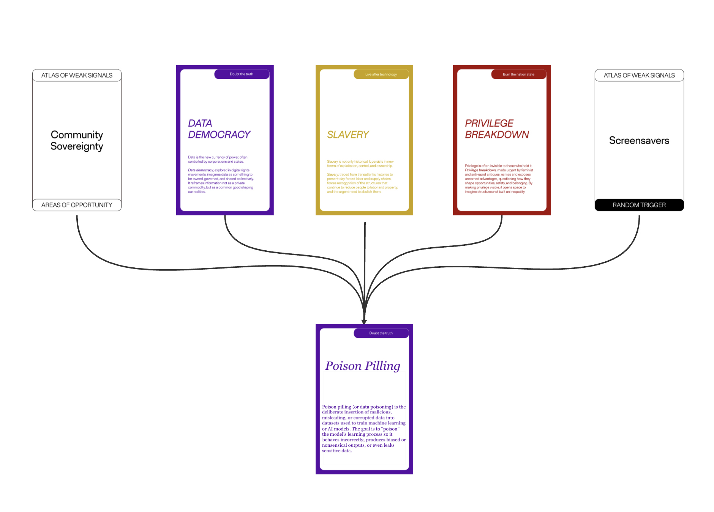

---
hide:
    - toc
---

# Atlas of Weak Signals

Atlas of Weak Signals is a collaborative and exploratory framework developed by FabLab Barcelona and the Master in Design for Emergent Futures. Rather than focusing on fully formed trends, it works with subtle, early signals—small shifts in technology, culture, and social behavior that quietly suggest how futures might unfold. The Atlas encourages designers to slow down, observe carefully, and question how design can intervene before change becomes normalized.

Poison Pilling refers to the deliberate insertion of misleading, malicious, or corrupted data into datasets used to train AI and machine learning models. While this practice is usually discussed in technical or security-oriented terms, our interest went beyond that. For me, Poison Pilling exposes a deeper tension between control, vulnerability, and authorship within artificial intelligence systems. It raises questions about who holds power over knowledge, and how easily “intelligence” can be shaped, distorted, or resisted through data.

To push this inquiry further, we asked ChatGPT how it perceived the idea of data poisoning. Turning the AI itself into a participant revealed an unexpected layer of reflection—blurring the line between tool, subject, and collaborator. This gesture made the signal less about sabotage and more about awareness.

Poison Pilling, as a weak signal, points toward emerging futures where data is no longer neutral or invisible, but actively political. It suggests a world in which trust in AI systems is continuously negotiated, challenged, and redesigned.

