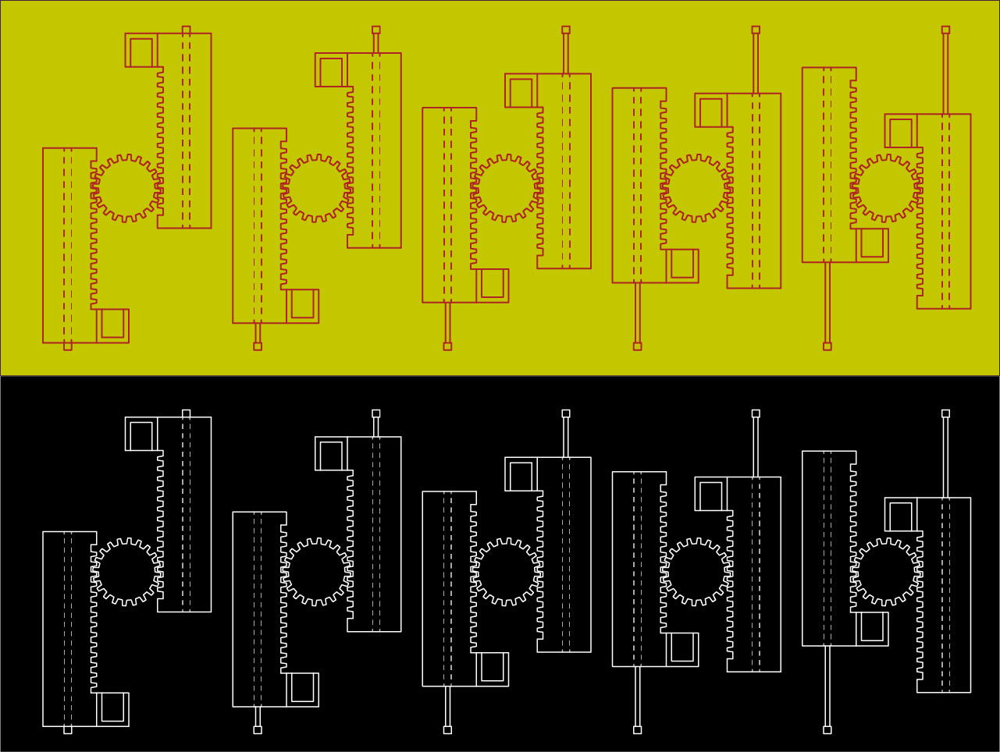
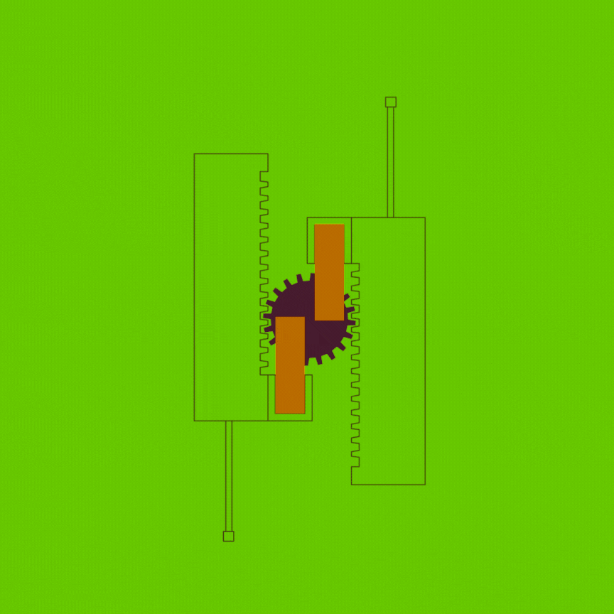
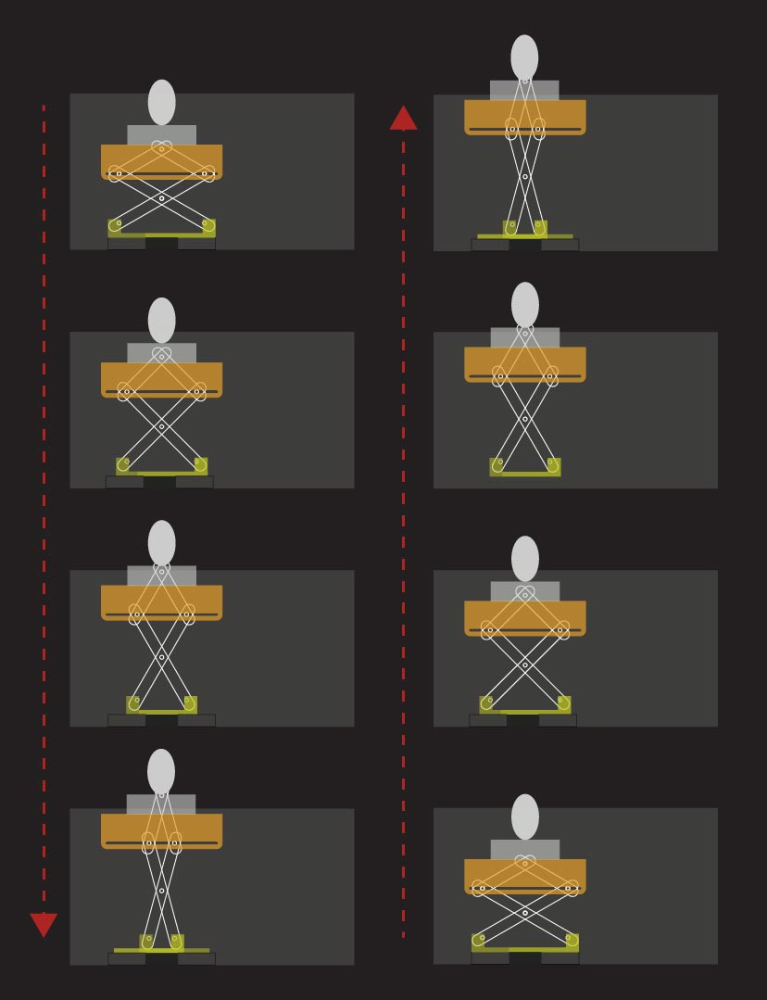

---
hide:
    - toc
---

# Unpacking tech systems II

<iframe width="560" height="315"
    src="https://www.youtube.com/embed/u10ZErixy5Y"
    title="YouTube video player"
    frameborder="0"
    allow="accelerometer; autoplay; clipboard-write; encrypted-media; gyroscope; picture-in-picture"
    allowfullscreen>
</iframe> 

# Forensics of Obsolescence: The Radio
Reimagining an Obsolete Electronic Device Through Play, Mechanics, and Interaction

# Project Overview
Many electronic devices are discarded not because they are broken, but because they lose relevance over time. As technologies evolve and user habits change, objects that once held clear functionality gradually become obsolete and are replaced, even when they remain technically functional.

This project investigates obsolescence not as a mechanical failure, but as a cultural and functional displacement.
The objective of this workshop project was to analyze an electronic device through a forensic approach, identify the reasons behind its obsolescence, and redesign it by introducing a new function that creates a meaningful user experience.

The chosen object was a Sunstech vintage AM/FM radio, originally designed for domestic audio playback.
Through a detailed forensic examination, the device was disassembled, documented, and tested component by component.
The analysis revealed that:
1. All major electronic components were functional
2. The radio was capable of receiving and playing audio
3. There was no technical malfunction
 The failure of the object was therefore not mechanical but contextual. In a contemporary landscape dominated by smartphones, streaming platforms, and wireless audio systems, the radio no longer fit into modern usage patterns. Its obsolescence was driven by changing consumer behavior rather than physical degradation.

# From Diagnosis to Design Intention
Rather than repairing or upgrading the radio to match modern audio technologies, the project deliberately avoided restoring its original function.
 Instead, the design strategy focused on repurposing the object into a playful, interactive, and emotionally engaging artifact.
The intention was to transform the radio into a “useless machine”, an object that does not solve a practical problem but provokes curiosity, surprise, and joy through interaction.

# Ideation Process
During the ideation phase, three alternative conceptual directions were explored:
1. Adult Tamagotchi
A reinterpretation of a nostalgic childhood toy for adult users.
 Instead of caring for a virtual creature, the device would remind users of real-life responsibilities such as hydration, social connection, or self-care.
2. Pandora’s Box
An interaction inspired by forbidden curiosity and internal conflict.
 Through buttons, switches, and latches, the user would trigger an internal voice that could not be fully accessed — suggesting hesitation, temptation, or an unspoken need for help.
3. Jumping Clown Surprise Mechanism
A playful and disruptive concept inspired by classic pop-up toys.
 The object would unexpectedly reveal a clown through physical movement and sound, creating a moment of shock followed by humor.
After evaluating emotional impact, narrative clarity, and technical feasibility, the Jumping Clown concept was selected as the final direction.

# Design Strategy
The selected concept aimed to combine:
Traditional toy mechanics (pop-up motion)

Contemporary electronic control (Arduino-based actuation)

Sound and physical interaction

The design draws inspiration from classic Jack-in-the-box toys while replacing spring-based systems with motor-driven, controlled movement.
The original wooden radio casing was preserved and reused as the main enclosure, maintaining the object’s historical and aesthetic identity.

# Prototyping and Development
Early Physical Prototypes
Initial exploration began with rough cardboard mock-ups.
 These low-fidelity prototypes were used to study:
1. Internal spatial constraints
2. Motion paths
3. Scale and proportion of the pop-up mechanism

Electronics and Motion Testing
Arduino-based systems were tested using:
1. DC motors
2. Buttons and joystick inputs
3. Audio playback modules

The goal was to synchronize mechanical movement with sound output through user interaction.

## Mechanical Iteration
Several mechanical components were initially 3D printed.
 During testing, these parts proved insufficient due to:
1. Low structural strength

2. Breakage under repeated motion

This led to a redesign of the system using laser-cut wooden components, resulting in a more durable and stable accordion-style mechanism capable of extending and collapsing smoothly.

## Assembly and Troubleshooting
The final stages involved continuous trial-and-error assembly, alignment corrections, and mechanical refinement.
 Each iteration revealed new constraints, which were addressed step by step through adjustment and redesign.

# Intended Interaction Flow
The planned interaction sequence was defined as follows:
1. User presses a button
2. Arduino receives the input
3. Motor activates and extends the accordion mechanism
4. The clown pops out of the box
5. A prerecorded voice plays a playful message

This interaction was designed to create a controlled pop-up animation activated through direct engagement.

# Results and Limitations
While the mechanical structure and physical behavior of the object were successfully developed, the project did not reach a fully stable final state due to coding and system integration limitations.
Until the final days before submission, the system was partially functional.
 The mechanical pop-up action worked, and the object reached an advanced prototype stage. However, inconsistencies in the code and interaction logic prevented the electronics, sound, and motion from operating reliably as a unified system.
Despite extensive testing, debugging, and iteration—even up to one day before the deadline—the software behavior could not be fully stabilized within the available time frame.

# Conclusion and Reflection

Although the project did not result in a fully functioning final prototype, the process itself represents a valuable and realistic design outcome.
This project demonstrates that:
- Obsolescence is often a matter of relevance, not failure

- Complex systems require parallel development of mechanics, electronics, and code

- Not all design challenges are solvable within limited time constraints

Rather than presenting a polished illusion of success, this work reflects the real conditions of experimental design practice — where persistence, iteration, and learning are as significant as the final result.
The project succeeded in:

- Reframing an obsolete object through interaction

- Exploring play as a design strategy

- Challenging technical and conceptual boundaries

- Revealing the complexity of integrating hardware and software

Even though the system did not fully perform as intended, the radio was transformed from a forgotten object into a site of experimentation, inquiry, and creative effort.

