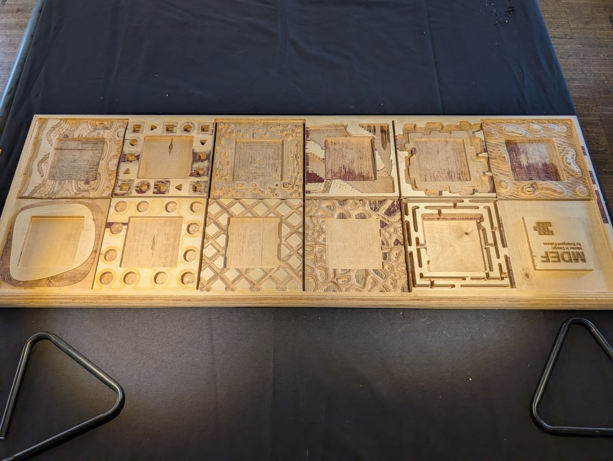

---
hide:
    - toc
---

# Fundamentals for Future Makers

## Laser Cutting & Mold Structure

In the first stage of the project, we focused on designing and fabricating the wooden mold structure using laser cutting. The initial step involved developing the design in Rhino, where I was responsible for creating the two main side panels of the mold.

The first side explored a fully abstract form, centered around curves and fluidity, inspired by the organic movement of worms in nature. The second side translated a more symbolic idea: two pine trees positioned back-to-back, creating a mirrored natural structure.

## Design Constraint:
One of the key challenges in this phase was adapting the designs to the technical limitations of the laser cutter. The laser paths could not be placed too close together, which required multiple iterations and design refinements. Ultimately, we selected and modified the final forms to comply with the laser cutter’s tolerances while preserving the intended visual identity.

Tools & Materials:
Laser Cutter
MDF
Rhino
Tolerance Calibration

# 3D Printing the Core Geometry

The second phase focused on creating the main solid piece with a cubic structure using a 3D printer. Here, we intentionally pushed the design concept further by drawing inspiration from the pyramids of Egypt and the Great Sphinx. Alongside the pyramidal forms, we added a small spiral element—referencing speculative narratives about extraterrestrial gateways connected to the Giza pyramids.

This piece was carefully modeled and prepared for 3D printing, with close attention to printability, wall thickness, and overall structural stability.

## Print Strategy:
Ensuring that the design was fully printable became a crucial learning moment. Managing supports, avoiding problematic overhangs, and preventing surface defects required a deeper understanding of slicing logic and printer behavior. This process significantly strengthened my comprehension of how digital geometry translates into physical form.

Tools & Materials:
3D Printer
PLA
Slicing Software

# Silicone Molding

After completing the 3D print, we moved into the molding phase using silicone. The printed piece served as the positive, and the silicone was poured and left to cure.

## Unexpected Challenge:
A major difficulty emerged during demolding. Since the laser-cut wooden panels were placed inside the mold and featured numerous small, closely spaced engraved details, the silicone bonded to them more strongly than anticipated. Separating the cured silicone mold from the wooden structure was unexpectedly difficult and required patience and careful handling.

This experience highlighted how small design decisions—such as density and proximity of details—can dramatically affect later fabrication stages.

Materials:
Silicone
Mold Release

# CNC-Milled Frame Inspired by Mycelium

CNC-Milled Frame Inspired by Mycelium

For the outer frame of the final piece, we used CNC milling, with the entire design process developed in Rhino. The conceptual inspiration for this frame came from the growth patterns of fungal mycelium—organic, branching structures that follow a natural yet complex logic.

The 3D form was modeled in Rhino and then prepared for CNC machining, resulting in a wooden frame with an expressive, biomorphic geometry. This organic enclosure was designed to contrast with—and simultaneously support—the rigid, geometric language of the pyramidal core.

Fabrication Insight:
This phase progressed without major technical challenges, allowing us to focus primarily on form development, surface continuity, and the translation of complex organic geometry into a subtractive manufacturing process.

Tools & Materials:
CNC Router
Wood
Rhino

 

# Biomaterial Casting

In the final fabrication step, we used the silicone mold to cast the core object using a biomaterial mixture. Once cured, the biomaterial piece—carrying the pyramidal and spiral geometry—was placed inside the CNC-milled mycelium-inspired frame.

This combination of biomaterials, digital fabrication, and natural form references created a layered narrative between ancient architecture, speculative mythology, and biological systems.

Materials:
Biomaterial Compound
Casting Process

# Final Reflection

This project was particularly valuable because each stage introduced distinct challenges that deepened our understanding of both tools and materials. From laser-cut tolerances and 3D print constraints to unexpected silicone adhesion, every obstacle became an opportunity for learning.

Anticipation
Design decisions made early in the process directly influenced later fabrication stages.

Adaptation
Problem-solving and flexibility were essential, especially when outcomes differed from expectations.

Integration
By combining laser cutting, 3D printing, CNC milling, and biomaterial casting, the project demonstrated how diverse fabrication methods can coexist within a single cohesive design system.

Ultimately, this experience reinforced that prototyping is not a linear process, but an evolving dialogue between concept, material, machine, and intuition.

