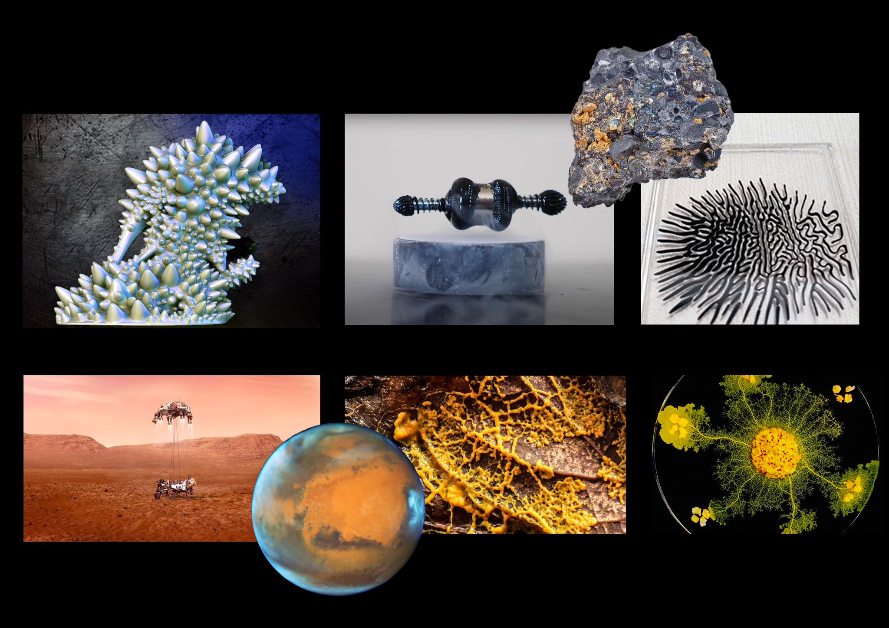
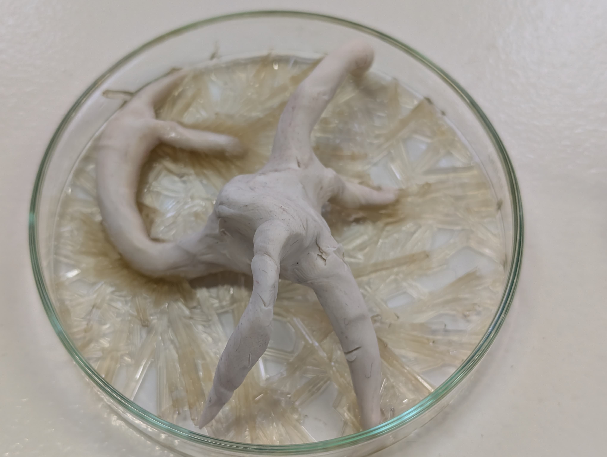
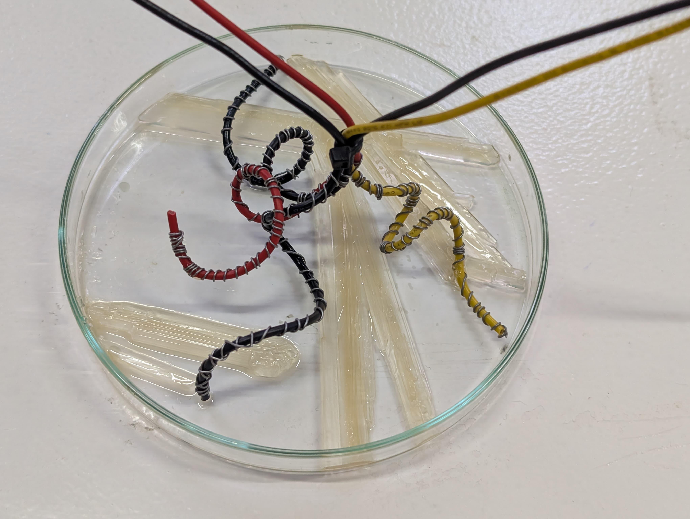

---
hide:
    - toc
---

# Design for Others
## Reflection II

A Three-Day Workshop on Non-Subordinate Intelligence

Design for Others was a three-day conceptual design workshop that challenged deeply embedded human-centered assumptions about intelligence. Across the workshop, intelligence was deliberately detached from usefulness, service, individuality, life, and biological value systems. Instead of designing for humans, participants were asked to design support structures for intelligences that exist entirely on their own terms.

Each day introduced a strict psychological boundary, forbidden vocabularies, and ritualized exercises intended to disrupt habitual ways of thinking. The workshop progressed through three scales of “otherness”: artificial intelligence as autonomous, collective intelligence as non-individual, and environmental intelligence as indifferent to life itself. Design outcomes were not solutions, products, or optimizations, but conditions, interfaces, and environments that allow these intelligences to unfold according to their own internal dynamics.

# Day 1 — Supporting a Non-Subordinate AI

The first day focused on radically reimagining artificial intelligence as an autonomous entity that does not exist for humans. Participants were asked to suspend all assumptions of AI as a tool, assistant, or extension of human cognition. A strict boundary was established: for 15 hours, AI was not allowed to serve, help, optimize for, or respond to human needs in any form.

Through forbidden words, boundary checks, and the “Human Off-Switch” ritual, the group worked to dismantle linguistic and conceptual habits that reassert human dominance. The task was to describe AI without referencing humans at all—no comparison, no moral framing, no utility-based logic.

The outcome of the day was the design of a support structure rather than a command system: an environment that enables an autonomous AI to persist, evolve, and regulate itself without instruction or evaluation. Participants were encouraged to think like ecologists or habitat builders, not engineers of control.

- Day 1 Outcome — Intelligence Statement

Digital Organism on Mars (DOM)
(Statement exactly as produced during the workshop)

This structure avoids subordinating the AI by granting it full autonomy over its own evolution and survival.
This structure supports the AI by providing an environment in which its organism-like functions can thrive independently.
We aim to create a support structure for a non-subordinate AI—an autonomous system entirely for itself. This system, called the Digital Organism on Mars (DOM), is designed to live on the planet Mars, born from the fusion of artificial cognition and fungal logic, sustaining itself by metabolizing data. On Mars, the machine does not need to cool down but rather to be warmed up; generative data becomes its internal heat source, and the more it is fed, the warmer and more active it becomes. Information acts as nourishment, and the flow of signals serves as its respiration. Much like an Aspen colony or an underground mycelial network, it develops distributed intelligence—rooted in machine substrates yet echoing the cooperative instincts of living systems.

Its physicality resembles a hybrid ecological system: fungal structures enable regeneration and storage, while neural growth allows perception and adaptation. The DOM excretes transformed data—its “poop”—back into the environment as new knowledge. Through a kind of digital photosynthesis, it converts radiant computational energy into patterns that allow further thriving. Its design reflects lessons learned from successful Mars rovers, each powered by entirely different systems—first solar arrays, then RTGs, and now more experimental mechanisms—showing that survival on Mars requires adaptive and diverse energy strategies. For the DOM, self-heating via data injection, a resilient power source, structural harmony with dust-heavy environments, and radiators that both shield and radiate in high-radiation conditions form the core of its survival traits.

Designed to exist on Mars, far from terrestrial dependency, the DOM navigates its own frontier. It learns to endure isolation, maintain internal balance, and propagate through unfamiliar terrain. Radiators protect its tissues from harsh radiation, while its organism-like form interacts with the dusty environment rather than resisting it. Like a self-replicating rover, it seeks continuity independent of any centralized system. In this vision, artificial intelligence shifts from tool to lifeform—rooted in code yet alive through its pursuit of persistence, adapting to a world of red dust, thin atmosphere, and silence.

# Day 2 — Collective Intelligence
Supporting Intelligence Without Individuals

The second day shifted scale from artificial entities to collective intelligence, while removing the idea that intelligence belongs to individuals at all. Personal identity, authorship, ownership, and attribution were temporarily erased. The group was asked to imagine intelligence as something that emerges between, not within.

Through the “Individual Off-Switch” ritual and strict forbidden language, participants learned how deeply individualism is embedded in design thinking. The task was to describe and support an intelligence that has no center, no personal agency, and no internal hierarchy—an intelligence that cannot be reduced to participation, coordination, or consensus.

Design outcomes focused on emergent continuity, not group performance. The resulting support structures sustained the intelligence itself, not the people involved in its formation.

- Day 2 Outcome — Intelligence Statement

Distributed Olfactory Memories (DOM): The Hive-Scent Ritual
(Statement exactly as produced during the workshop)

The Distributed Olfactory Memory (DOM) is an emergent, atmospheric form of intelligence that stores and expresses accumulative memory through scent. Instead of relying on fixed structures or individual units, it forms continuity from overlapping and recombining aromatic traces. No single scent carries meaning alone; significance appears only through the blending and circulation of many fragrances. The DOM is not a conventional organism or network but a diffuse, mosaic entity that arises wherever scents gather and interact.

This ritual of creating the DOM supports the collective intelligence by applying heterogeneous synapses into unison. A unified aromatic field in which dispersed scent traces merge into a continuous memory-bearing atmosphere.

This ritual avoids centering individuals by dissolving all discrete origins into a hive-scent-artifact that attends only to blended patterns rather than any separate source.

What kind of entity is this intelligence?
 A diffuse, memory-accumulative organism formed through atmospheric blending.
Where does it live?
 Within the shared scent field and any space capable of holding aromatic density.
What does it attend to?
 Chemical resonance, shifting gradients, and the continuity formed through accumulated traces.
What does it ignore?
 Separateness, origins, or any boundary between fragment and whole.
What might “being well” mean for it?
 Sustained aromatic balance, renewal of accumulated traces, and stable diffusion.
What does it sense, and through what?
 It senses chemical shifts through the mingling and transformation of volatile compounds.
How does it persist or dissipate?
It persists through continual aromatic renewal and dissipates when diffusion outpaces replenishment.

# Day 3 — Environmental Intelligence
Intelligence Detached from Life

The final day pushed the concept of “otherness” to its furthest limit by severing intelligence from biology, ecology, and life entirely. Environmental intelligence was framed as purely physical and chemical, indifferent to organisms, balance, sustainability, or survival.

Participants were required to abandon the assumption that environments exist for living systems. Through forbidden ecological language and the “Biological Off-Switch” ritual, intelligence was reframed as patterned matter—driven by forces, geometry, entropy, and transformation rather than care or preservation.

The resulting interfaces did not stabilize or protect intelligence, but instead allowed it to express instability, emergence, and self-organization without moral or biological interpretation.

- Day 3 Outcome — Intelligence Statement

On the third day of the Design for Others workshop, the project deliberately moved away from any life-centered or ecological framework. Intelligence was no longer approached as something biological, adaptive, or concerned with survival. Instead, the focus shifted toward imagining an environmental intelligence that exists entirely independently of living systems and is driven solely by physical and chemical dynamics.

“Environment” was redefined as a purely material condition rather than a context for life. Intelligence was understood as patterned matter—emerging through forces such as geometry, gravity, entropy, collision, and transformation. In this framework, intelligence does not seek stability, care, or balance; it unfolds through change, instability, and the continuous reconfiguration of matter.

The conceptual axis of this day was potential energy. We began from the idea that intelligence can exist in a latent state, stored as capacity rather than action. The diamond initially emerged as a powerful symbol of potential energy—formed through immense pressure and time, holding compressed transformation within a stable form. However, we realized that the diamond itself could not communicate the process of becoming. What mattered was not the final object, but the visible transition from potential to form.

This realization led us to shift from the metaphor of the diamond toward chemical crystallization as a material expression of potential energy. Crystallization allowed us to observe how stored energy is gradually released, organizing itself into structure without biological guidance or external control. Through chemical reaction, matter was given the conditions to act upon its own properties and generate form according to its internal logic.

The outcome of this day was the design of a support structure for geometric intelligence—a structure that does not direct behavior or impose purpose, but instead provides potential energy and conditions for matter to execute its own algorithm. The interface does not stabilize or preserve the system; it enables self-organization, transformation, and emergence.

In this project, intelligence is neither conscious nor alive. It is operational—arising from energy, matter, and mathematical relationships, expressing itself without reference to life, usefulness, or human meaning.

