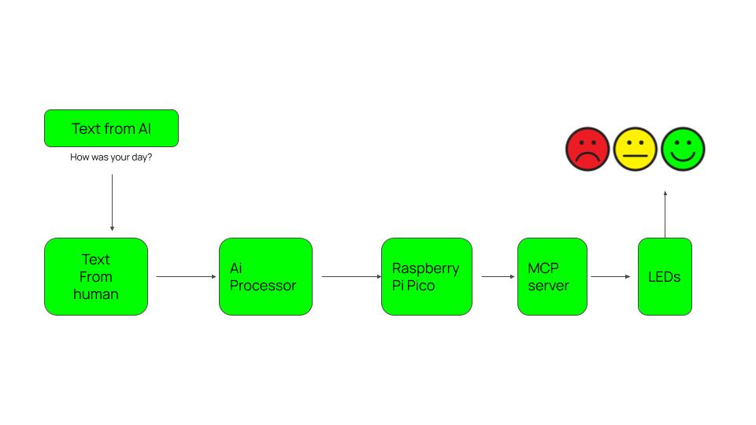
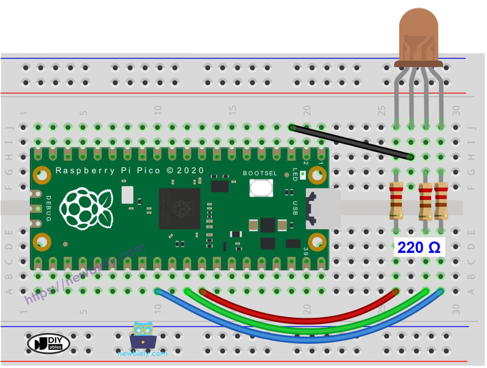
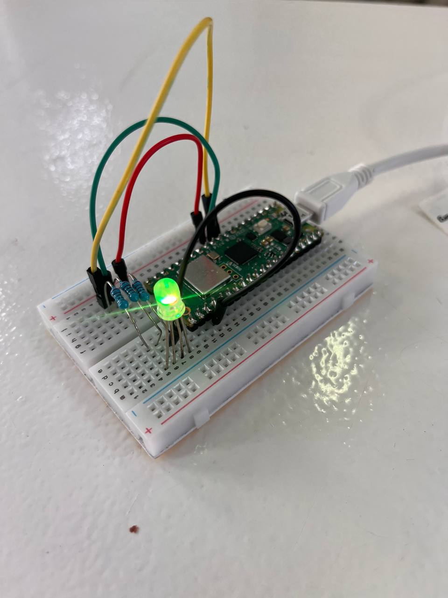
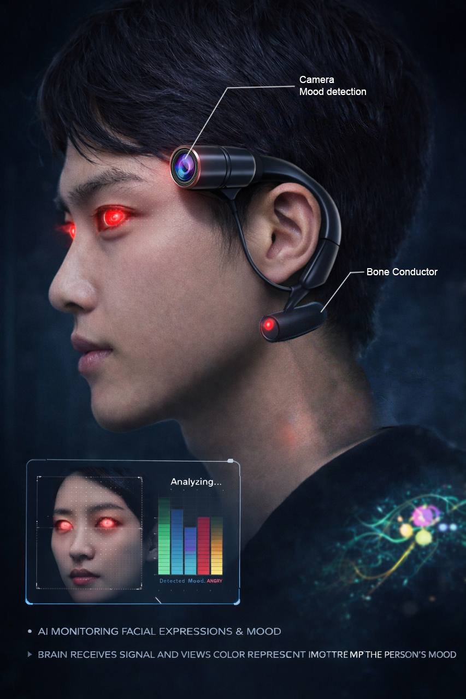

---
hide:
    - toc
---

# Extended Intelligences II

## AI-Integrated Mood Detection System
Translating Human Emotion into Physical Interaction

## Conceptual Foundation

This project began as an exploration of how artificial intelligence could interpret human emotional states through observable behavior. The original concept centered on a camera-based system capable of analyzing body movement and facial micro-expressions to detect mood in real time. The intention was to study how physical gestures and subtle behavioral patterns could be translated into emotional data through AI.
However, as the project progressed, practical time constraints required a strategic adjustment. Instead of abandoning the core idea, we shifted the input method from visual data to textual expression. While the initial vision focused on motion and micro-expression analysis, the implemented prototype analyzes written responses as the primary emotional indicator. This transition did not alter the conceptual foundation of the project. Rather, it reframed the input layer while preserving the central objective: translating human emotional states into tangible feedback through artificial intelligence.

## Project Vision and Purpose

The AI-Integrated Mood Detection System is designed as a human-centered interactive system that transforms emotional interpretation into physical output. The broader vision remains rooted in the analysis of human behavior—whether through movement, expression, or language—and the translation of that data into visible signals.
Although the current prototype operates through text-based interaction, the original direction of the project is grounded in camera-based behavioral analysis. The wearable concept envisions a system capable of detecting motion patterns and micro-expressions, interpreting them through AI models, and converting the results into color-coded feedback. By adapting the input from camera to text during development, we were able to validate the emotional classification logic while maintaining ethical clarity and technical feasibility within the given timeframe.

## Technical Implementation

In the current implementation, the system begins with a user’s written response to an open-ended question such as “How was your day today?” The text is processed by an AI Mood Analysis Agent that evaluates tone, context, and linguistic structure to identify the dominant emotional state based on Paul Ekman’s seven universal emotions.

Once classified, the emotional output is transmitted to a Raspberry Pi Pico microcontroller. The microcontroller activates a corresponding LED color, physically representing the detected mood. The electronic circuit, built around resistors and RGB LED components, ensures stable signal transmission and precise color mapping.

While this prototype uses text as input, the architecture has been designed to accommodate future integration of camera modules and motion-based detection systems. The AI layer and hardware logic remain adaptable for multimodal expansion.

## Final Product Vision

The long-term vision of the product is a wearable emotional interface that integrates camera-based motion analysis with embedded AI processing. The device is conceived as a lightweight, ergonomic system capable of continuously interpreting subtle behavioral cues. In the conceptual design phase, the wearable incorporates a compact camera module positioned to detect facial expressions and movement, alongside a bone conduction interface for subtle feedback communication.

The prototype circuit shown represents the foundational electronic logic of the system. The rendered product visualization illustrates the intended final form—where AI-driven emotional detection operates seamlessly within a designed wearable object.

## Conclusion

Although the implemented prototype relies on textual input due to time constraints, the original and future-oriented concept remains focused on AI-based motion and behavioral analysis. The project demonstrates how artificial intelligence can translate human emotional states—whether derived from movement or language—into physical, perceptible signals.

At its core, this work investigates how AI can mediate emotional understanding. It does not seek to replace empathy, but to explore how intelligent systems might support clearer communication between humans.

