---
hide:
    - toc
---

# Cognitive Orgies I
## BloomBite
Interspecies Communication & Reversed Control

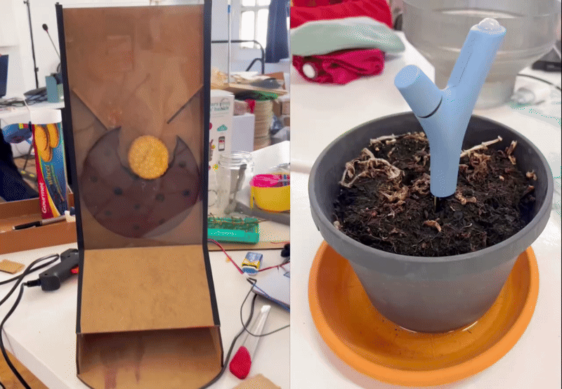

## Concept Development

This project began as an ethical investigation rather than a technical one. I structured the research into eight conceptual phases, starting from a broad reflection on the Earth as a shared ecosystem and gradually narrowing the focus toward animal consciousness, particularly the awareness and agency of horses. The core question emerged from phase three, which explored the relationship between humans and non-human species. Why is communication often framed as control? Why are non-human beings positioned as passive tools for human comfort, productivity, or pleasure?
In this phase, my teammate and I questioned whether it would be possible to design a system in which humans are not controllers, but responders. Ideally, we wanted to explore this dynamic through horses, as they represent a powerful example of interspecies relationship shaped by domination and utility. However, due to the limited time available for building and testing a functional communication system, we decided to begin with a plant. Plants allowed us to prototype a responsive system within a shorter timeframe while still maintaining the conceptual integrity of non-human agency.
BloomBite emerged from this shift. Instead of designing a system that helps humans control plants better, we designed a system where plant well-being determines human reward.

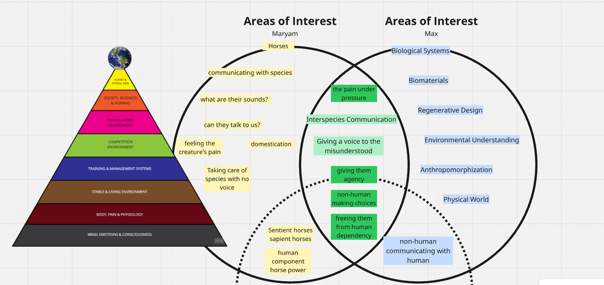

## Project Evolution
The project evolved from a conceptual ethical inquiry into a fully functional interactive system. At first, the focus was entirely theoretical—how to construct a communication pathway between species without reinforcing dominance. Gradually, the project moved into defining measurable biological signals that could represent the plant’s state. Soil moisture became the primary parameter, as it directly reflects plant health and care.

From there, the idea of a reward mechanism was introduced. If the plant is healthy, the human receives something desirable. This reversed the traditional hierarchy. The plant became the decision-maker within the system. The human’s role shifted from controller to caretaker whose actions influence outcomes but do not directly command them.

## Technical Implementation
As the project developed, I became deeply involved in the electronic and mechanical implementation of the system. The communication pathway required integrating a soil moisture sensor, Arduino, Python, and a motorized cookie dispensing mechanism. The technical challenge was not only to make the components function individually but to ensure that they operated as a coherent responsive system.

A particularly interesting challenge occurred when integrating the motor into the circuit. When first connected, the motor rotated continuously and could not be controlled through code. The issue stemmed from uncontrolled current flow. By incorporating a MOSFET transistor into the circuit, I was able to regulate power delivery and allow the Arduino to control the motor’s rotation precisely. This adjustment transformed the system from unstable mechanical behavior into controlled movement driven by logic conditions.

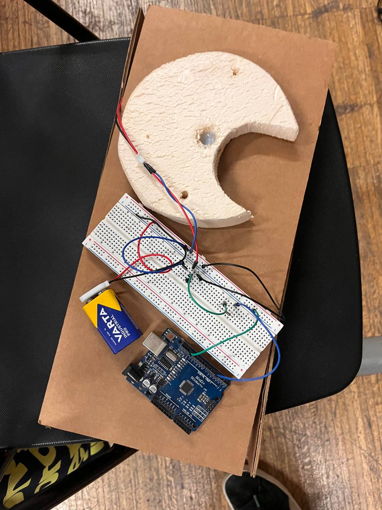
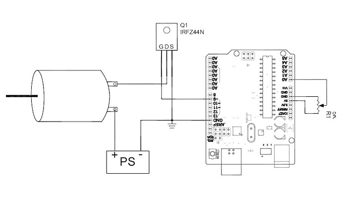

The integration between Arduino and Python also presented several difficulties. There were moments when Python successfully read the soil moisture data but failed to send the appropriate execution command back to Arduino. This required restructuring the serial communication logic, refining timing synchronization, and debugging both scripts extensively. Once stabilized, the system functioned as intended: when the sensor detected a healthy moisture level, the motor was activated and the cookie was dispensed.

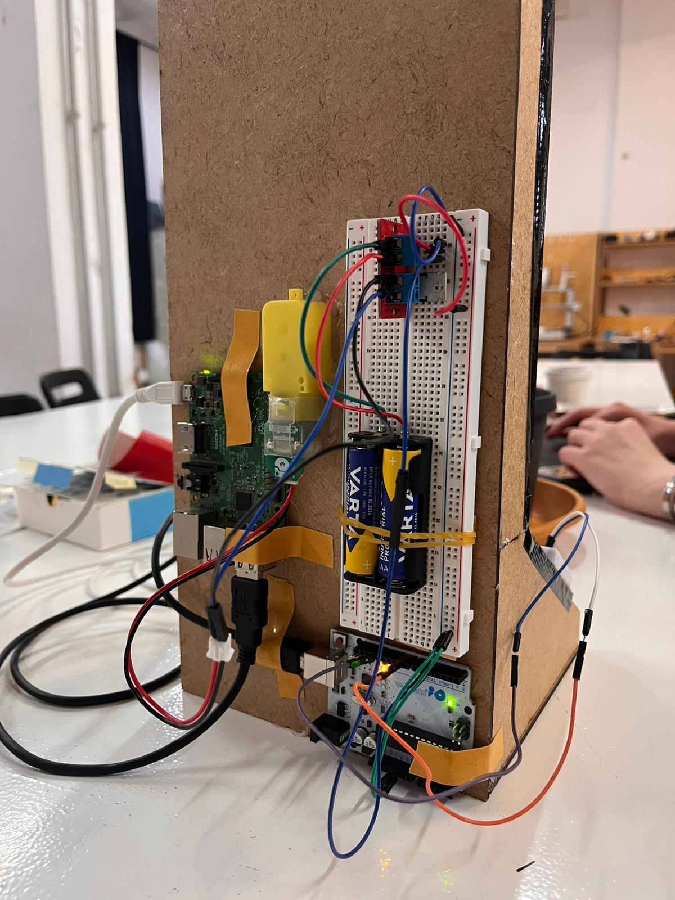

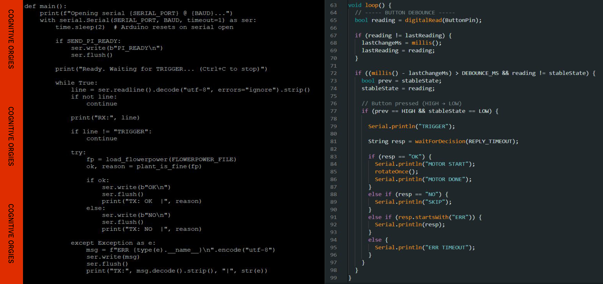

## Mechanical Development and fabrication
Designing the cookie dispensing mechanism required multiple iterations and hands-on experimentation. I personally tested different mechanical approaches before achieving a reliable solution. Early prototypes faced issues such as over-rotation, inconsistent dispensing, and occasional jamming. Through building and rebuilding, adjusting tolerances, and refining the internal structure, I developed a controlled rotating armature mechanism that releases a single cookie per activation.

Constructing a physical prototype was essential to understanding the relationship between digital design and real-world material behavior. Each mechanical revision improved the system’s precision and reliability.

The structure of the device was fabricated using a combination of laser-cut wood and plexiglass, along with 3D printed components for the moving mechanical parts. Working directly with these fabrication tools significantly expanded my technical knowledge. Designing digitally was only one part of the process; understanding material resistance, joint stability, and friction required iterative physical testing.

Through this process, I gained practical experience in digital fabrication, mechanical integration, and structural design. The project became not only an exploration of interspecies ethics but also a deep technical learning experience.

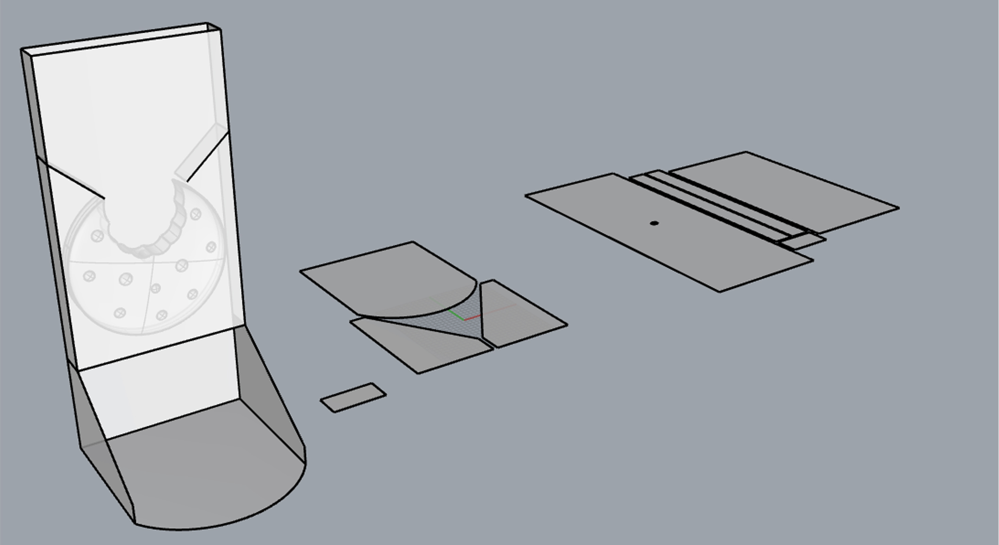

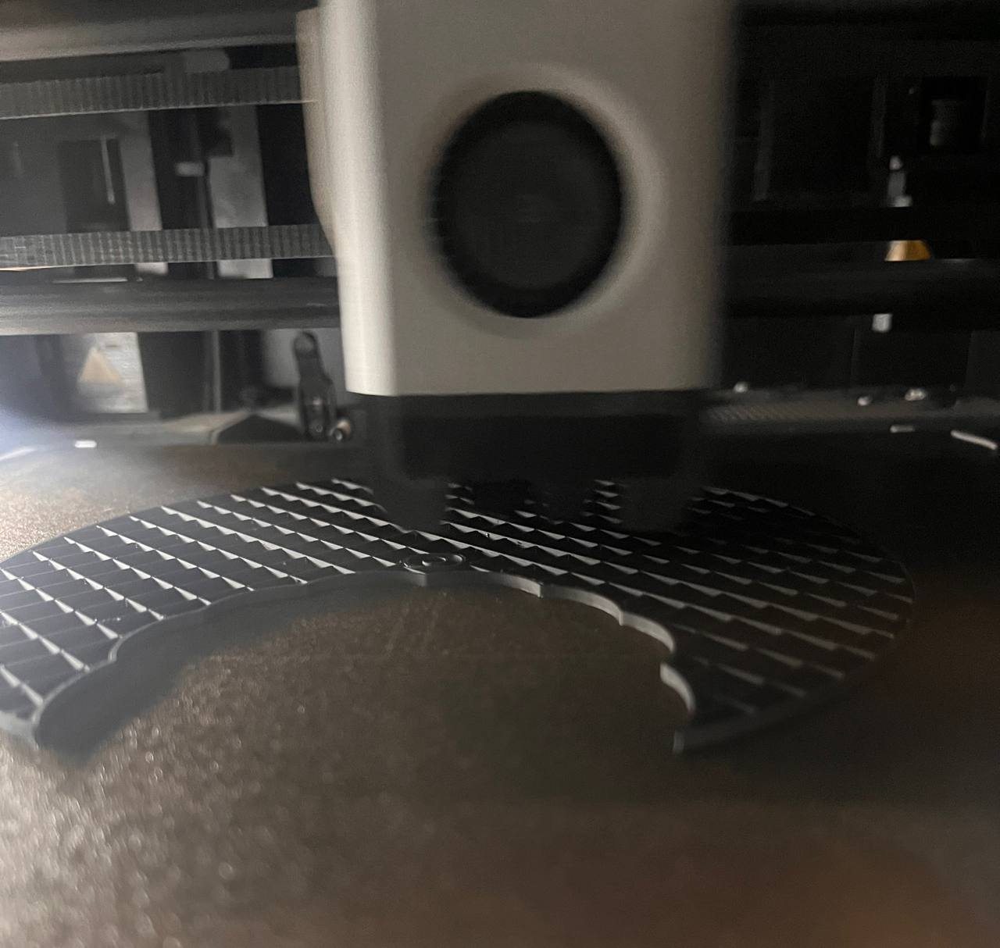

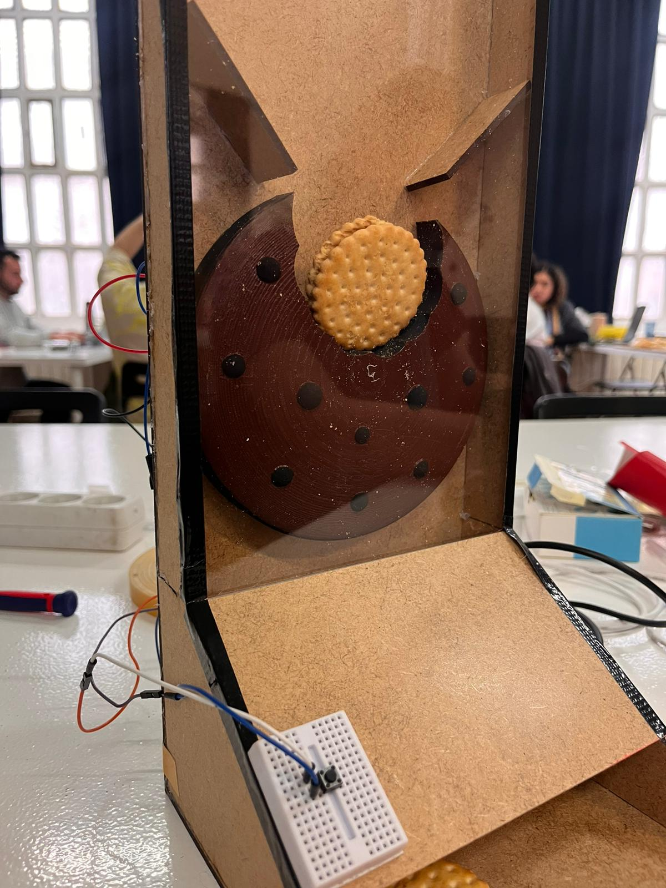

## System Behavior
In its final state, BloomBite operates as a closed-loop responsive system. When a human presses the button, the system checks the plant’s soil moisture condition. If the plant is in a healthy state, the motor rotates and dispenses a cookie. If the plant is not healthy, no reward is given. The plant’s condition directly determines the outcome of the interaction.

This creates a subtle but meaningful shift in power. The plant influences human experience. The human must care in order to receive.

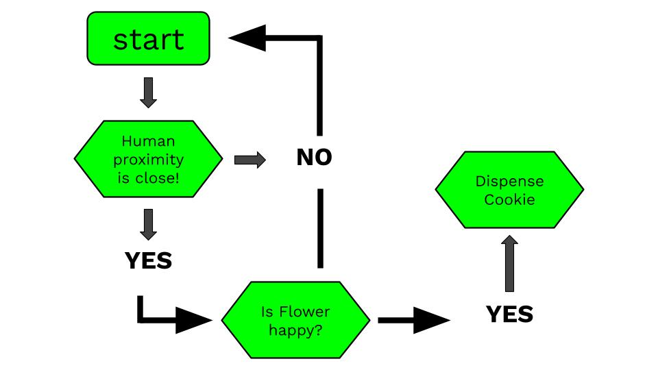

## Reflection
BloomBite represents both a conceptual and technical journey. It challenged my understanding of interaction design by positioning non-human life as an active participant within a technological system. At the same time, it pushed me beyond theoretical thinking into deep electronic troubleshooting, hardware–software integration, and mechanical prototyping.

The project ultimately asks a simple but radical question: what happens when humans are no longer the center of control, but part of a responsive ecological relationship?

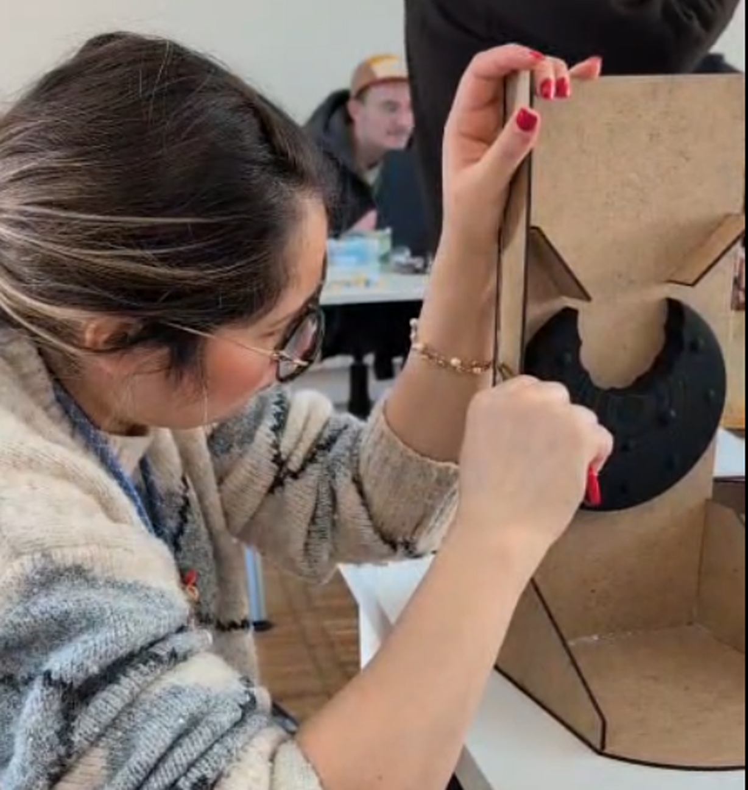

