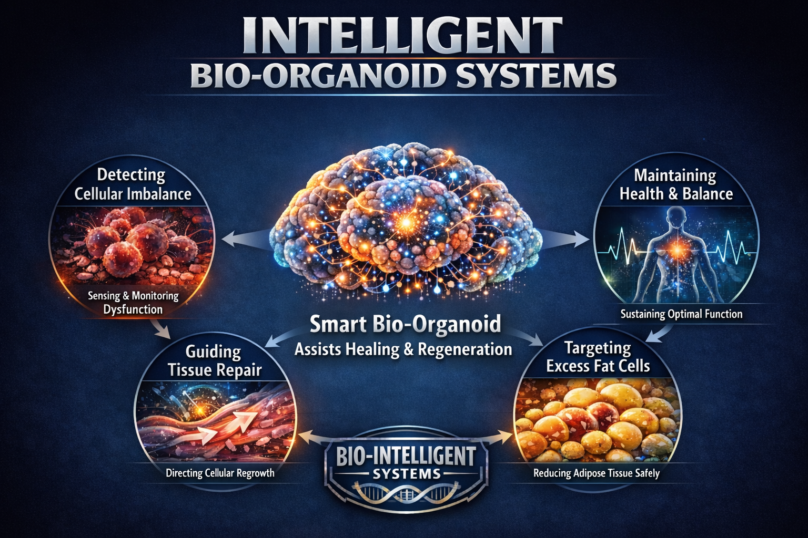

---
hide:
    - toc
---

# Extended Intelligences III

## BIO-INTELLIGENT COEXISTENCE EXTENDING THE HUMAN MANIFESTO

  <iframe 
    src="https://www.youtube.com/watch?v=UGH1-3lYJhQ" 
    frameborder="0" 
    allow="accelerometer; autoplay; clipboard-write; encrypted-media; gyroscope; picture-in-picture" 
    allowfullscreen
    style="position: absolute; top:0; left: 0; width: 100%; height: 100%;">
  </iframe>

The Body as Sovereign: A Vision for Intelligent Bio-Organoid Systems
At the intersection of biotechnology and philosophy, the concept of Intelligent Bio-Organoid Systems presents a compelling vision for the future of medicine. The diagram depicts a "Smart Bio-Organoid" capable of detecting cellular imbalance, guiding tissue repair, targeting excess fat cells, and maintaining overall health , a miniature biological intelligence operating quietly within the human body.
What distinguishes this vision from conventional AI-in-medicine narratives is its manifesto: a firm declaration of bodily sovereignty. Where much of today's discourse around AI and healthcare centers on optimization and automation, this framework insists that no external intelligence holds final authority over the human body. The bio-organoid is framed not as a replacement for human biological agency, but as an extension of it , an organ among organs, serving the whole.
The manifesto's most striking move is its rejection of the colonization metaphor so often embedded in techno-medical language. "The body is not a territory," it declares. Instead, it proposes dialogue , a coexistence in which adaptive systems may learn and respond, but always in deference to the living human at the center. This is the "Wetware Era": not a surrender to machine intelligence, but an evolution guided by our own.
In this sense, Intelligent Bio-Organoid Systems is less a product pitch than a philosophical provocation , a reminder that as biology and technology converge, the most important design question remains a human one: who decides?

