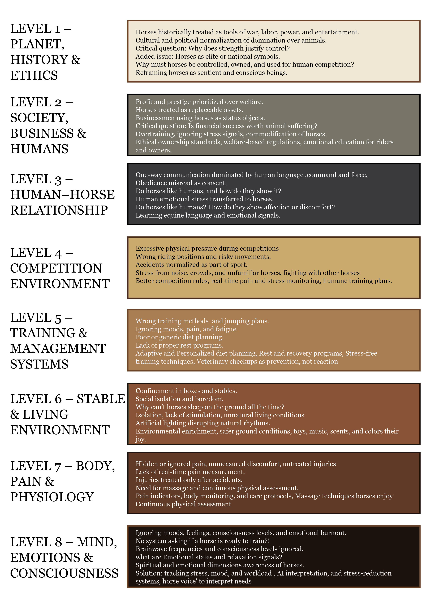
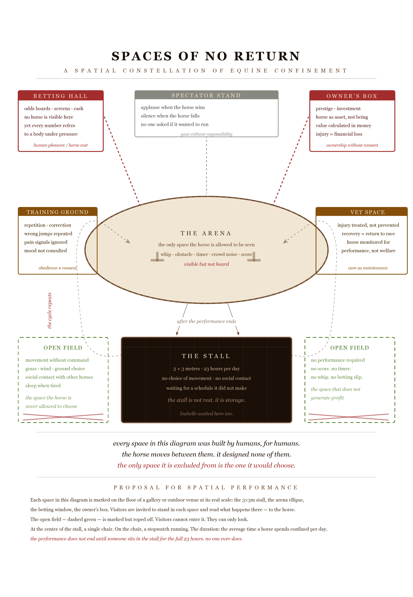
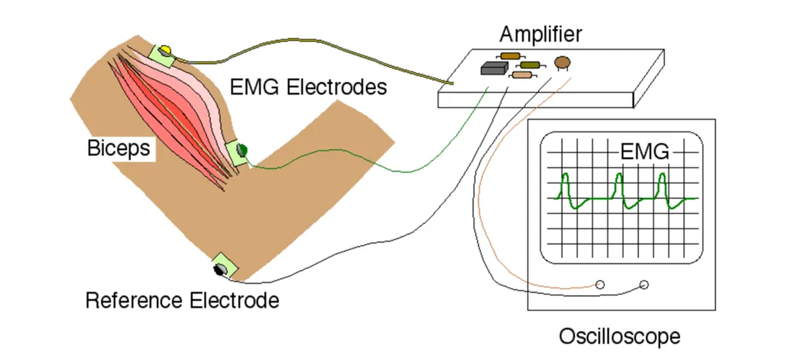
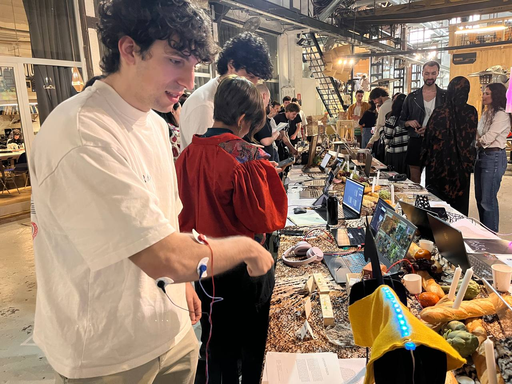
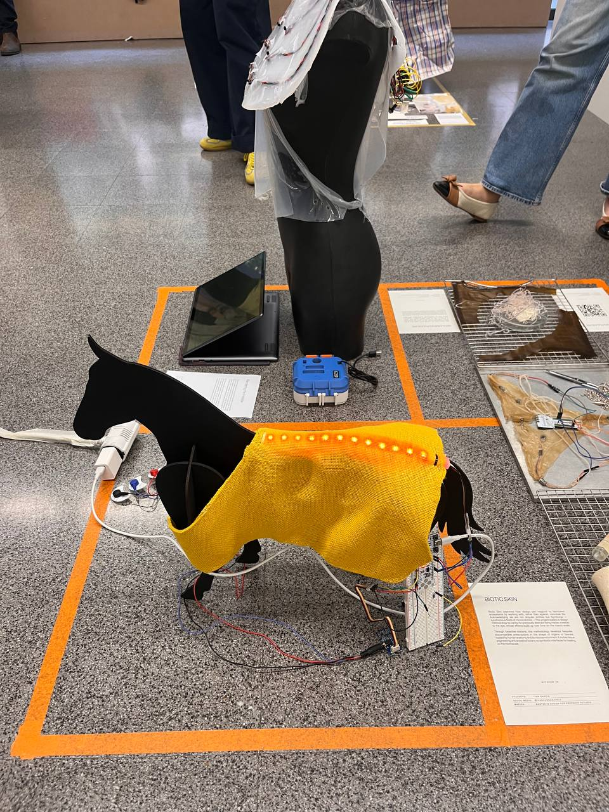
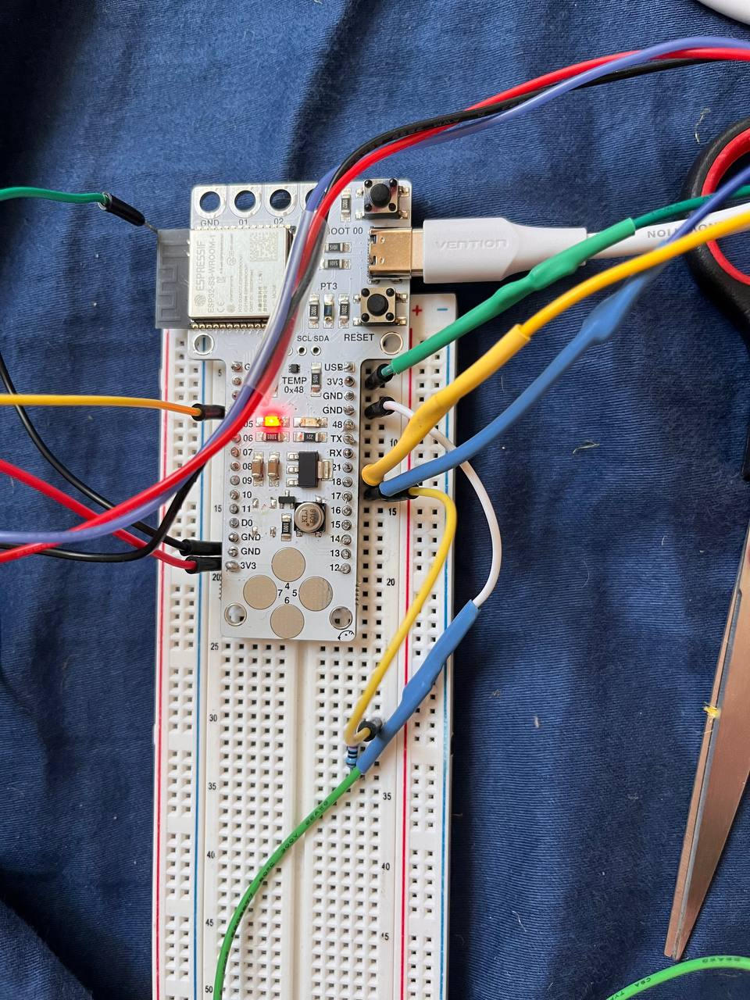
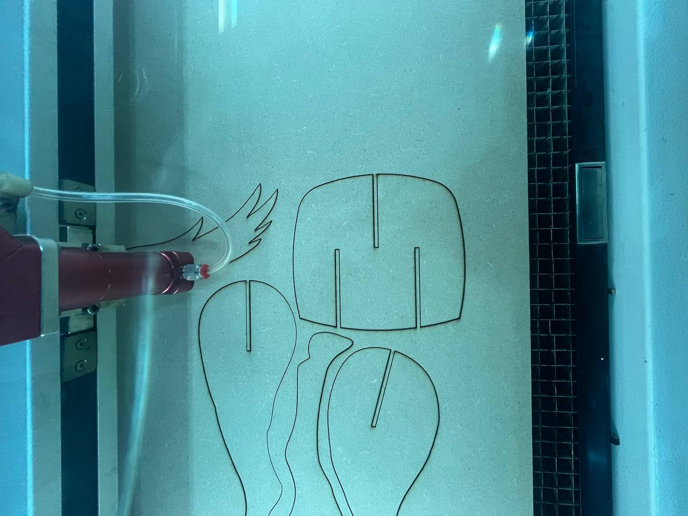
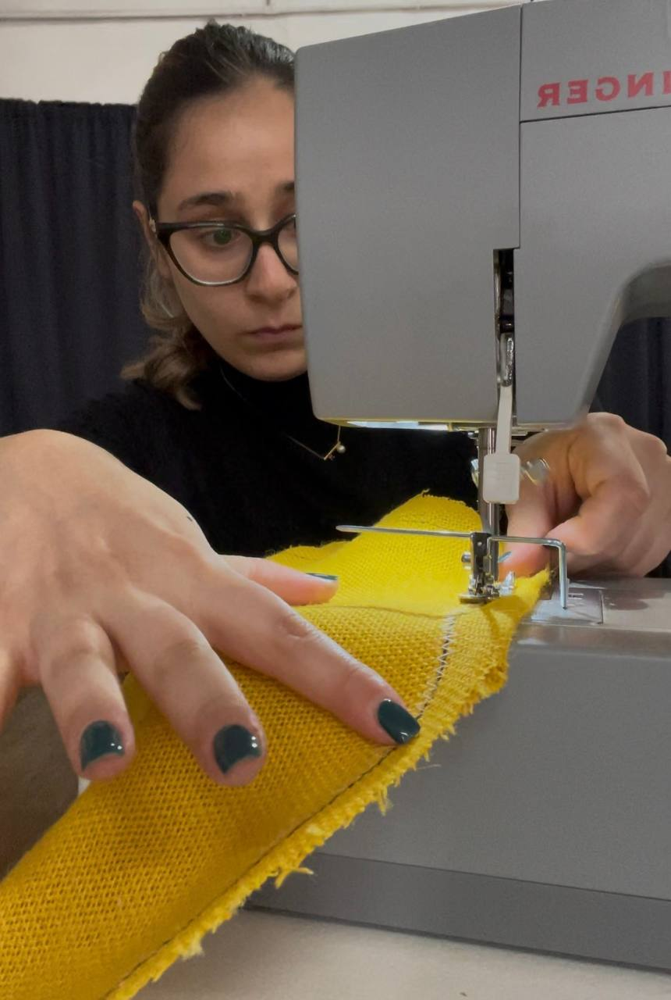

---
hide:
    - toc
---

# Design studio II

# Problematize Yourself
## Errors:
I thought that horses really don’t like competition conditions and feel a lot of pressure, but in the behavior analysis I did during a competition, the result was different and surprising.
I paid little attention to the horse’s body language in normal conditions and during the competition, and I couldn’t observe the horse’s behavior very precisely.
I saw the system in black and white; in some places I was very radical, didn’t see the gray areas, and viewed everything negatively, while in some situations the horse and rider enjoy being together and working alongside each other.
I pushed my topic too much toward betting on horses, while I wanted my focus to be on show-jumping competitions.
I haven’t solved any problems for the horses yet, and so far it has only been about raising awareness.
## Fascinations:
To better understand horse behavior in competition, I put myself in beginner-level show jumping competition conditions.
How is a horse’s behavior in competition different from its normal behavior? The excitement of the horse during competition is very interesting to me.
The relationship between the horse and the rider can be very deep, especially the emotional side of it.
Do horses see us as teammates, or just as someone who wants to force them to win a competition?
Horses can understand our emotions, fears, or even our next movements without making eye contact with us (even when we are riding them) and react to them. I find it interesting how this happens. How can a horse read what’s inside humans’ minds?

# Problematize Ethics
1 — Me | Personal Relationship and Emotional Attachment

My relationship with horses goes back more than twelve years; from the first time I rode to just a short time ago when I was still participating in competitions. For many people outside this field, the suggestion seems simple: if horses are under pressure, then we should ride them less or not compete at all. But the reality of this relationship is not that simple for me.
This relationship is not one-sided; it is a connection between two living beings who gradually become attached to one another, grow accustomed to each other, and form an emotional bond. It is precisely this bond that makes the ethical question of my project complicated. Stepping away from a horse or cutting this relationship is not merely a logical or professional decision; it means breaking an emotional connection that has consequences for both me and the horse. This attachment is, at the same time, a source of meaning and a source of ethical conflict within my project.

2 — My Community | Norms, Pressure, and Normalization

At the level of the immediate community,equestrian spaces, clubs, and competitions,harm to horses is often normalized as “part of the path to progress.” Training pressure, back-to-back competitions, and ignoring the physical limitations of the horse do not always occur out of direct violence, but rather as a result of established norms.
The ethical issue here lies in what kinds of behavior are considered normal and acceptable, and what is overlooked. When a trainer, a system, or an environment justifies excessive pressure, the horse has no voice to object, and decisions are made on its behalf. My project problematizes ethics at this level: a space where harm is not treated as an exception, but as an acceptable cost of success.
Horses do not have the ability to give informed consent. They cannot say whether they want to enter a competition or how much pressure they are willing to bear. My project is entangled with the ethical tension of how much a horse’s cooperation is a choice, and how much it is the result of training, conditioning, and coercion. To what extent can we understand whether a horse actually enjoys competition or experiences it as stress? Even when a horse appears excited during a competition, the question remains whether this excitement is a result of choice or a product of a system we have created for it.

3 — Society | Industry, Competition, and Power

At a larger scale, equestrian competitions are part of a broad industry shaped by economic interests, competition, and power. At this level, the horse is often seen as capital, a tool for winning, or a component of a performance-driven system. Even if the individual relationship between rider and horse is emotional, the overall structure of this industry can reproduce pressure, injury, and exhaustion. In some cases, betting on horses frames them not as living beings struggling to fulfill human desires, but as pieces in a game designed to win.
The ethical issue at this level of the project is whether focusing on personal narratives and emotional relationships risks overlooking these larger structures. My project cannot change this industry, but it carries the responsibility of keeping open the question of how competition, status, money, and winning come to take priority over the body and life of a living being.

4 — Planet | Human–Non-human Relations and Long-term Responsibility

Ultimately, my project looks at the relationship between humans and non-human beings on a broader scale. Horses are not merely part of a sport or an industry; they are living beings with bodies, pain, limitations, and specific capacities. The ethical issue at this level is the human-centered nature of decision-making: the extent to which humans allow themselves to place other beings in high-risk and high-pressure situations for the sake of pleasure, competition, or progress.
My project raises the question of what kind of future is being shaped for such relationships.
Can the relationship between humans and horses be redefined in a way that allows enjoyment, movement, and companionship to be mutual and sustainable? Or does it remain confined within frameworks that accept harm as an inevitable cost?

# Problematize Narrative

Maybe I’m not talking about a cardboard box. I’m talking about those beings that humans interact with, beings that people first approach with a friendly gaze, and then harm as much as they can. In the end, when they see that the creature has already suffered the maximum damage it can bear, they begin to completely destroy it.
A clear example might be horses. Throughout history, humans initially saw the horse as a beautiful and inspiring creature. But over time, look at what humans have done to horses: they pushed them beyond their limits and used them as tools, tools for entertainment, leisure, agricultural labor, transportation, and more. And even after inflicting so much harm, humans still exploit them. They don’t even spare the body after death, using the skin to make clothes and for other purposes.

    
    

  <iframe 
    src="https://www.youtube.com/watch?v=n6bntZhZez0" 
    frameborder="0" 
    allow="accelerometer; autoplay; clipboard-write; encrypted-media; gyroscope; picture-in-picture" 
    allowfullscreen
    style="position: absolute; top:0; left: 0; width: 100%; height: 100%;">
  </iframe>

    
    

# Problematize Objects
## BloomBite
Interspecies Communication & Reversed Control

https://maryamshoj.github.io/mdef-template/term2/02-Cognitive%20Orgies%20I/

# Problematize Space

# Design Dialouges

## UNSPOKEN TENSION
The project explores the hidden harm horses experience in competitions and the contradiction between riders' emotional connection with horses and the pressure of competitive systems.
While these sports appear elegant, many horses experience fatigue, injury, and physical strain. The project also opens a future direction that considers the idea of giving horses more agency, questioning whether they should have greater influence in decisions about participation in riding or competitions.
To make the horse's physical condition more visible, the project introduces a system using an EMG sensor to read muscle activity.
These signals are translated into light, creating a simple visual indicator of possible strain or discomfort. This muscle-to-light translation was chosen because horses cannot verbally express pain, while light provides an immediate and easily understandable signal that can draw human attention to the horse's condition.

## The Idea
The central question is simple: what if we could see what the horse feels? The project does not aim to control or analyze the horse — it aims to create empathy. A luminous blanket worn by the horse changes color based on muscle activity. Blue means full rest. Green means light effort. Yellow means moderate strain. Orange means hard work. Red means pain. No training is required to read it — the horse communicates directly to human instinct. A rider who sees the blanket glowing red should feel something. That feeling is the entire purpose of the project.

## The EMG Sensor
The technical foundation is a Grove EMG sensor attached to the horse's muscle with gel electrodes. Electromyography measures the tiny electrical signals produced when muscles contract. The sensor picks up this activity and sends a continuous stream of numbers to the microcontroller — low numbers when the muscle is relaxed, higher numbers when the muscle is working hard or experiencing pain. Three electrodes are placed on the body: two on the muscle itself and one on a bony area as a reference ground, ensuring a clean and accurate reading of the muscle's true state.

## The Arduino and the Code
The brain of the system is a Barduino 4.0.2 — an ESP32-S3 based microcontroller. The Arduino code reads the raw EMG values continuously, smooths them using a rolling average of 30 readings to eliminate noise and create fluid transitions, and then maps the smoothed value to a position on a color spectrum. The mapping uses linear interpolation between six color stops — blue, cyan, green, yellow, orange, and red — so the light never jumps abruptly between colors. Instead it flows, dances, and breathes with the horse's muscle activity. The blend speed is carefully tuned so that the light feels alive, not mechanical. When the horse tenses a muscle, the blanket slowly warms from blue toward red. When the muscle relaxes, it flows back toward blue. The light is as honest as the horse itself.

## The Laser Cut Horse and the Blanket
To present the project, a physical model of a horse was fabricated using laser cutting. The horse's body was designed as a series of interlocking flat panels cut from plywood, assembled into a three-dimensional standing sculpture. The blanket — the area across the horse's back and sides where a riding blanket would normally sit — was designed to house the LED light strip. The neon LED strip runs along the inside of the blanket, diffused through a translucent material so the light glows softly across the entire surface rather than appearing as individual points. When the EMG sensor detects muscle activity, the entire blanket responds as one unified surface of color — a living, breathing visualization of the horse's inner state, visible to everyone in the room.

