---
hide:
    - toc
---

# From Waste to Form
## Coffee Grounds Composite, Material Research, Fab Lab 2026

## 01, Why Coffee Grounds?
Coffee is one of the most consumed beverages on the planet, and one of the least thought-about waste streams. Every cup brewed leaves behind a mass of spent grounds, and almost all of it goes straight into the bin.
When I started thinking about this project, I wasn't looking for a material first. I was looking at what gets thrown away without a second thought. Coffee grounds appeared over and over, at home, in offices, in cafés. Dark, moist, abundant, and entirely organic. The more I looked, the harder it became to justify not working with them.
From an environmental standpoint, spent grounds are not a neutral waste. When they go to landfill, they decompose anaerobically and emit methane, a greenhouse gas significantly more potent than CO₂. The infrastructure for composting them exists but is rarely used at scale. Most of this material simply vanishes into rubbish bags, carrying a real environmental cost that nobody accounts for.
But beyond the environmental argument, there is a material argument. Spent coffee grounds contain lignin, cellulose, oils, and proteins. They are granular, hygroscopic, and structurally interesting at the micro level. They aren't an inert filler. They are an actual material with properties that can be designed around.

## 02, Tracing the Waste Stream
Before testing anything in the lab, I spent time observing where coffee grounds actually come from, at home, in shared kitchens, and in commercial coffee bars.
The volume is staggering once you start paying attention. A domestic filter machine produces a full cone of wet grounds every morning. At home, a standard pour-over or drip filter produces around 20 to 30 grams of wet grounds per brew. In a household making one pot a day, this adds up to over 10 kilograms per year from a single machine.
In office kitchens the situation is more intense. Machines run multiple times daily and nobody is tracking the output. It goes directly into general waste bins, mixed with everything else, with no recovery.
Coffee shops are where the scale becomes undeniable. A busy espresso bar can produce 15 to 25 kilograms of spent espresso pucks per day. The pucks arrive pre-compressed and relatively dry, which actually makes them ideal raw material. I stood at a coffee shop counter and watched the barista knock the puck out with a single sharp tap. Twenty seconds later, the machine was already pulling the next shot. I counted seventeen pucks in ten minutes. That was one machine, at one café, on a Tuesday morning.
What struck me most wasn't just the quantity. It was the consistency. Every batch of grounds has the same granularity, the same residual moisture, the same dark colour. This isn't random organic waste. It is a surprisingly uniform material, generated reliably, in the same places, every single day. That consistency matters enormously for material development. If you are trying to design a composite, knowing that your raw input will behave the same way batch to batch is foundational. Coffee grounds pass that test. They are, in a sense, an industrial material hiding inside a domestic ritual.

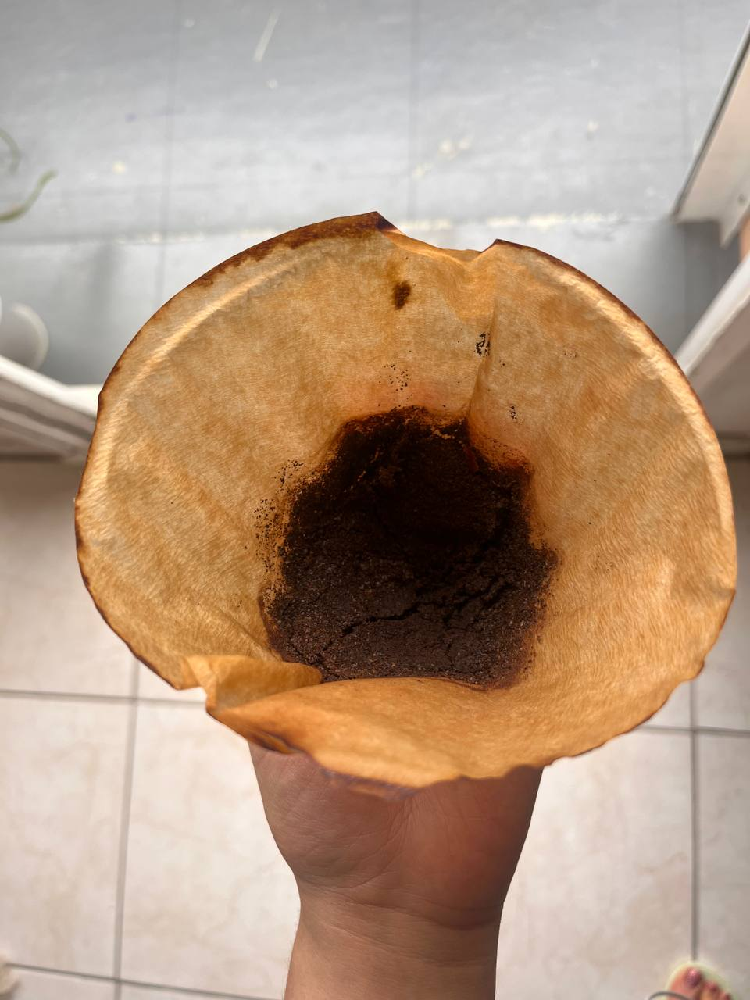

## 03, Making the Material
With a clear waste stream identified, the next question was binder chemistry, what could hold the coffee grounds together into a workable, shapeable mass?
The constraints were important from the start. The composite needed to be bio-based, use accessible ingredients, and be workable by hand or with simple tools. I wasn't aiming for industrial production. I was looking for something that could be mixed, pressed, and shaped in a workshop.
My base formula across all experiments was a high proportion of coffee grounds, approximately 50 to 60 percent by weight, combined with different binder systems. The grounds provide mass, texture, and visual character. The binder provides cohesion and workability. Getting that ratio right is the central challenge of the whole project.
I worked through five samples, adjusting the binder type and the proportion of structural fillers. Each sample was mixed by hand, pressed into small slabs, and left to air-dry. I recorded the workability during forming, the surface appearance as it dried, and the final strength and behaviour of the cured material.
One thing I learned very quickly is that you cannot judge these materials too early. The composite changes completely as it loses moisture. What looks weak and soft when wet may become remarkably strong when fully cured. What looks acceptable at 24 hours may crack by 72. Patience is not optional here. It is part of the method.

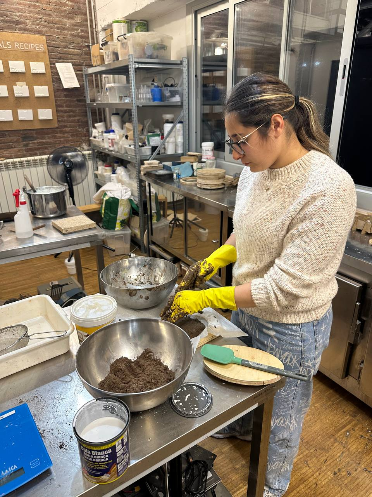

## 04, The Five Samples

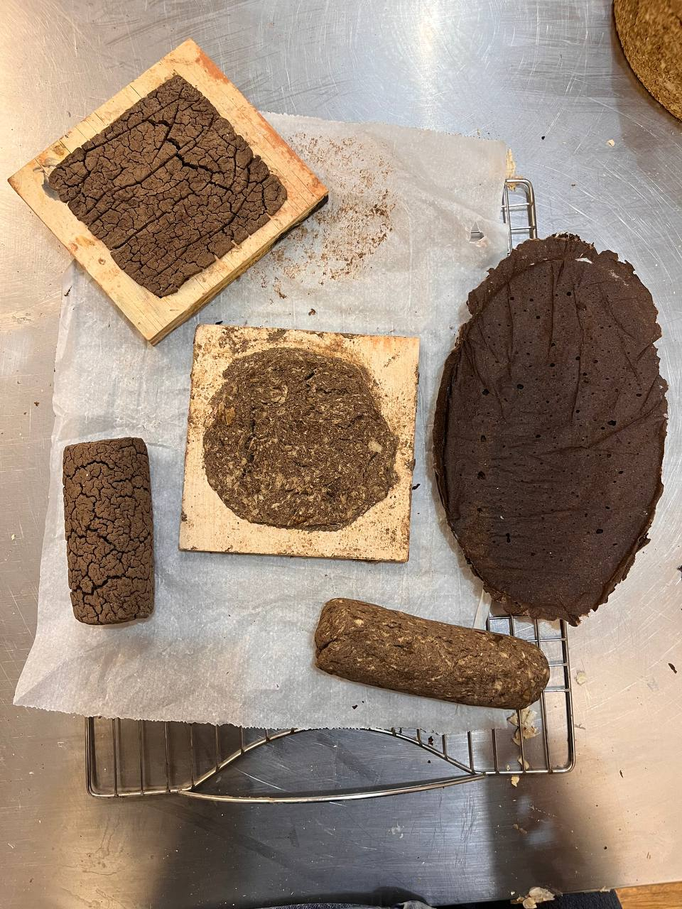

- Sample 1, Coffee Grounds + PVA Wood Glue + Corn Starch + Vinegar
Composition, 60% coffee grounds, 25% PVA wood glue, 10% corn starch, 2% vinegar (note, the remaining 3% was unaccounted in my original notes and likely water content in the grounds).
Result, fragile, failed.
This sample cracked during and after drying. It was so fragile that it was impossible to handle without it breaking apart. The PVA alone as the primary binder was not sufficient to hold the grounds together at this ratio. The material had no workable life, it could not be shaped or pressed without falling apart, and the final cured state was unusable.

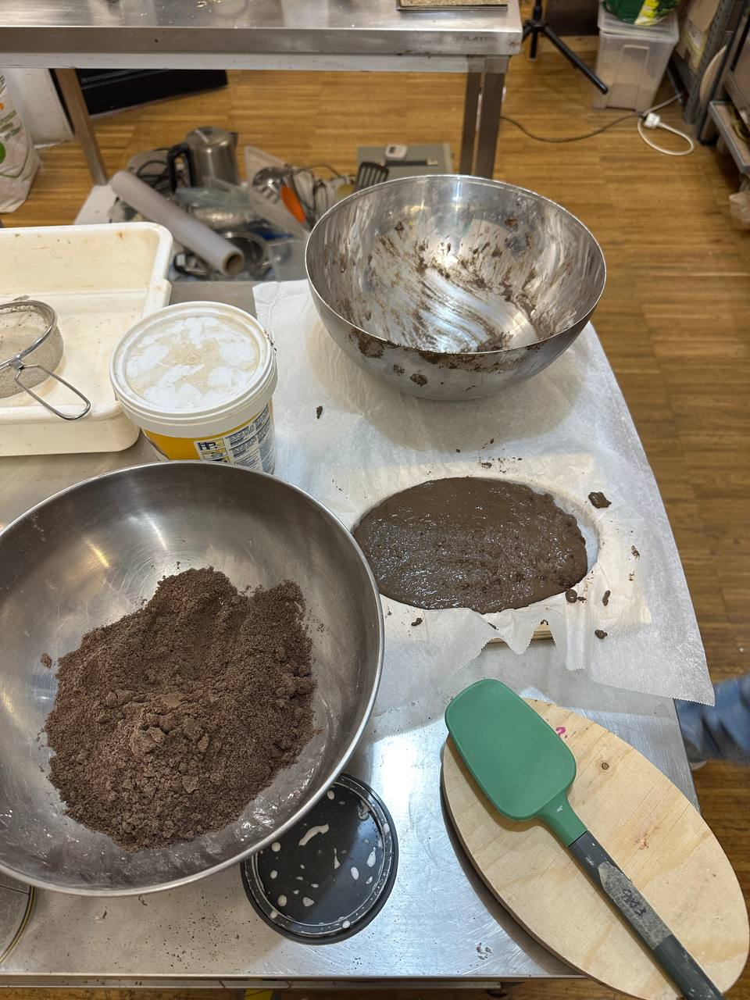

- Sample 2, Coffee Grounds + Cornstarch Glue + Corn Starch + Vinegar
Composition, 60% coffee grounds, 30% cornstarch glue, 8% corn starch, 2% vinegar.
Result, too flexible, inconclusive.
This sample was too flexible and not strong enough for structural use. However, this result needs to be taken with caution because the sample had not fully dried at the time of testing. It is possible that with complete curing the stiffness would improve significantly. This formula cannot be ruled out yet. It needs more time and a proper re-evaluation once fully dry.

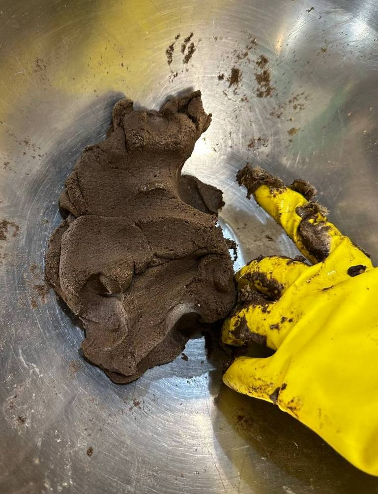

- Sample 3, Coffee Grounds + Cellulose Fibre + Cornstarch Glue + Corn Starch
Composition, 60% coffee grounds, 20% cellulose fibre from wet egg carton, 10% cornstarch glue, 10% corn starch.
Result, strong, excellent.
This was the best result so far. At first the sample was very wet and not strong enough, which was discouraging. But after it dried fully, it became remarkably strong. The egg carton cellulose fibres appear to act as a natural reinforcement inside the matrix, distributing stress and preventing the cracks that appeared in the other samples. The surface quality is good and the material feels genuinely solid. The use of wet egg carton, itself a recycled material, adds another layer of circularity to the formula.

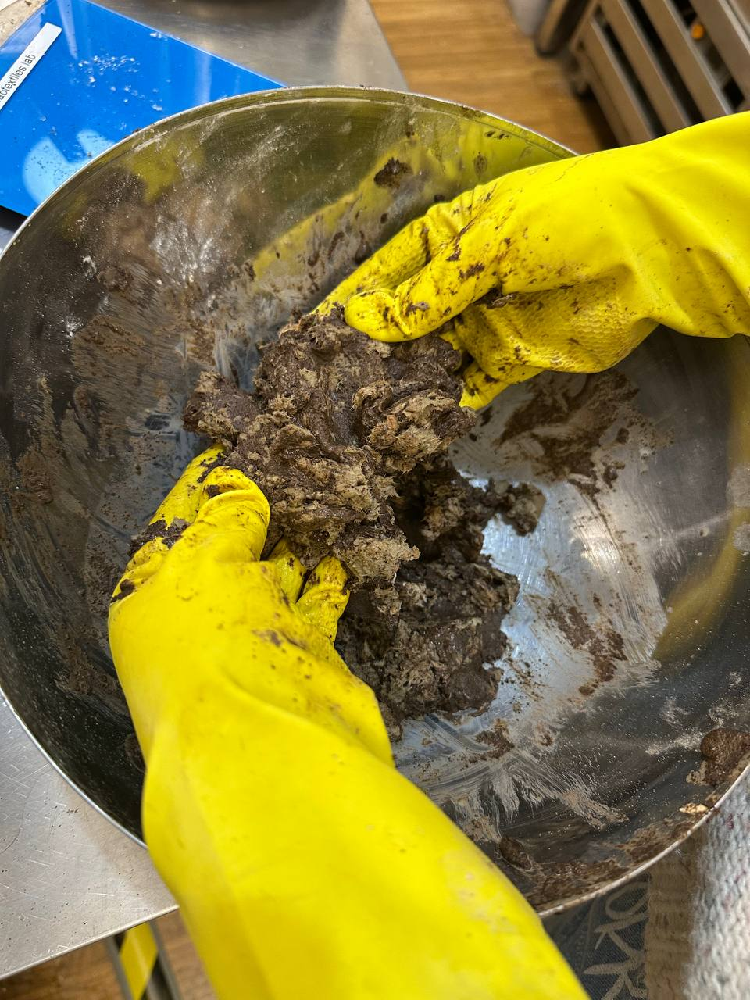

- Sample 4, Coffee Grounds + Wood Fibre + Cornstarch Glue + Corn Starch
Composition, 50% coffee grounds, 30% wood fibre, 10% cornstarch glue, 10% corn starch.
Result, awaiting full cure, looking very promising.
After three days of drying, this sample appears strong, well-formed, and aesthetically very appealing. The wood fibre gives a slightly different textural quality compared to the egg carton in Sample 3. Based on what I can observe so far, this formula has a good chance of being strong enough and it looks very good. I am waiting for complete drying before making a final assessment.

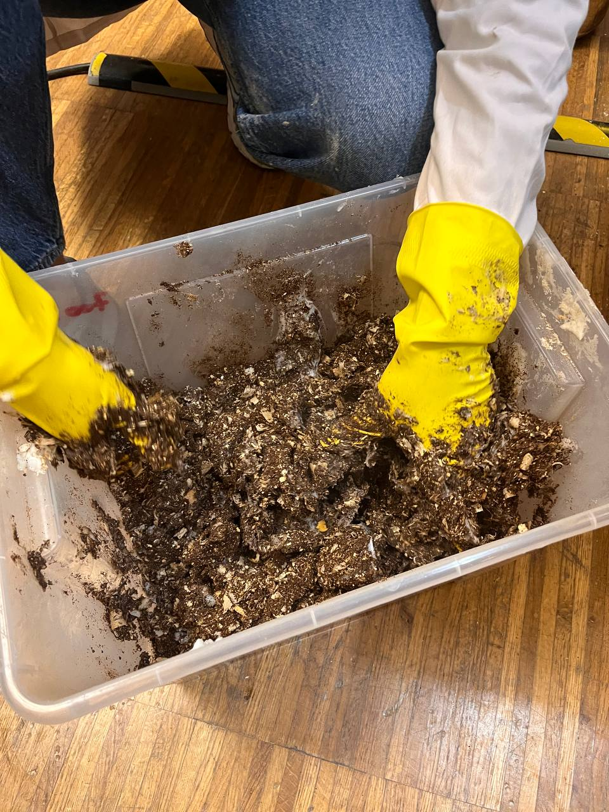
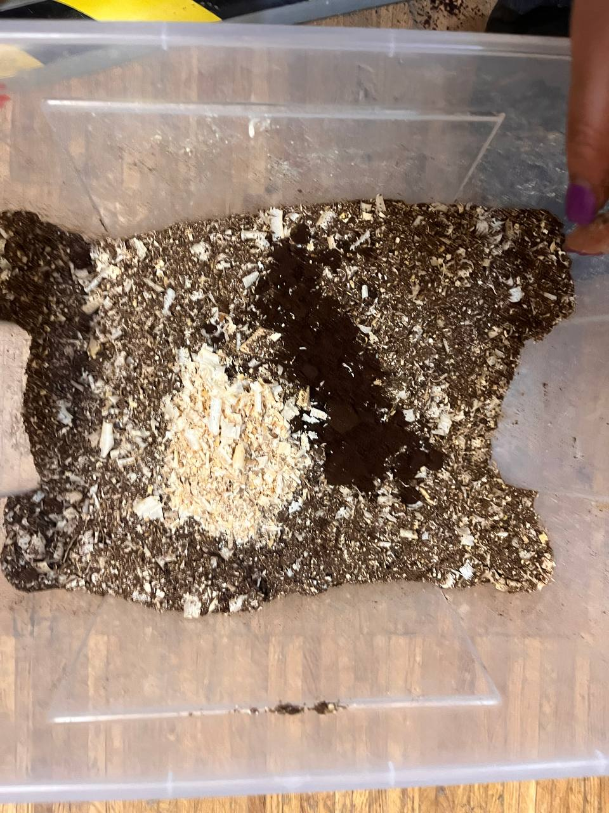
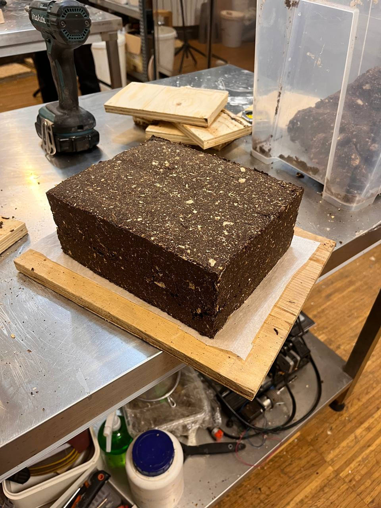

- Sample 5, Coffee Grounds + High Wood Fibre + Cornstarch Glue + Corn Starch
Composition, 50% coffee grounds, 50% wood fibre, 10% cornstarch glue, 10% corn starch.
Result, cracking, fragile.
Increasing the wood fibre proportion to 50% produced a material that cracks badly as it dries. Too much fibre without sufficient binder leads to internal stress during shrinkage. The sample is fragile and structurally unusable. This ratio does not work. Based on the comparison with Sample 4, the sweet spot for wood fibre appears to be around 30%, not higher.

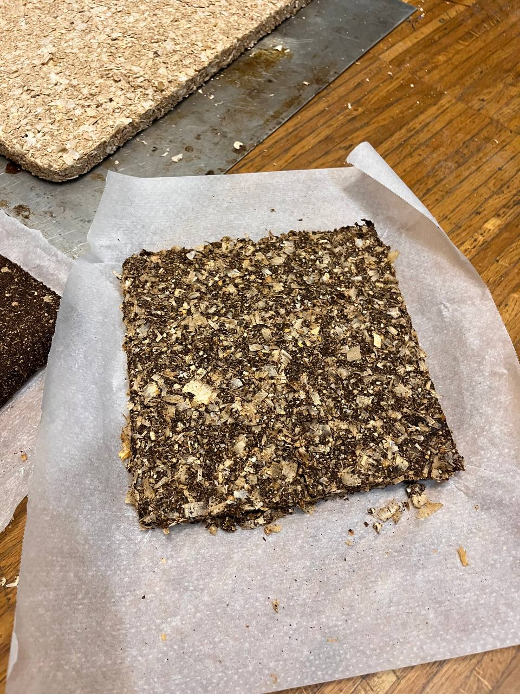
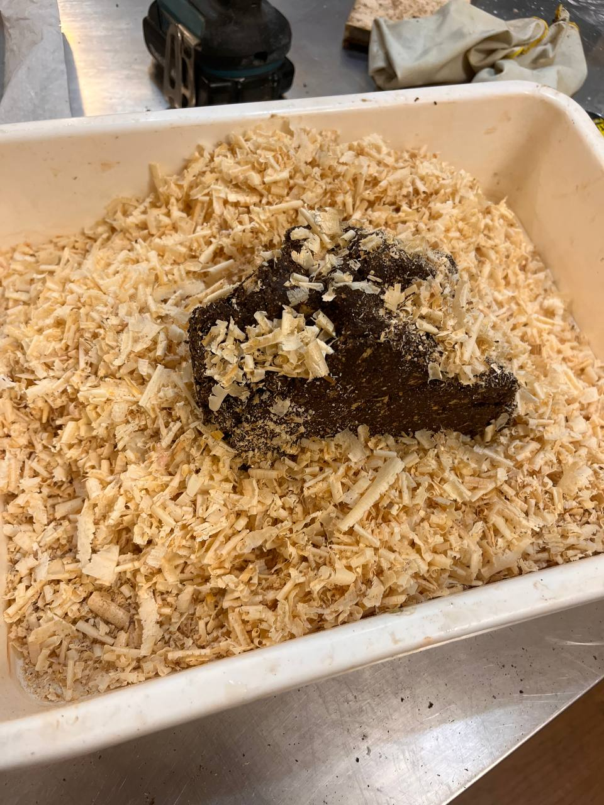

I also tested the materials in different thicknesses to evaluate their resistance to pressure.

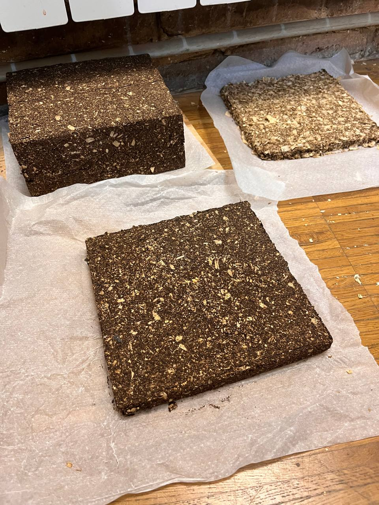

## 05, What I Have Learned
Five samples in, the research is pointing clearly in one direction. Cellulose fibre reinforcement is essential. Samples without fibre failed or performed poorly. Samples with fibre, whether from egg carton or wood, showed significantly better structural integrity.
The fibre ratio has a ceiling. Sample 5 proved that increasing fibre too much causes cracking. The fibres create internal tension as the binder shrinks during drying, and beyond a certain point that tension tears the material apart. The range of 20 to 30 percent seems to be the workable zone.
Drying time is a variable, not a formality. Every evaluation must wait for full curing, at least 48 to 72 hours. This is not just about waiting for the surface to feel dry. The interior of the slab continues to change structurally as moisture leaves. Premature testing produces misleading results.
Egg carton is a surprisingly powerful reinforcer. Sample 3, the strongest result so far, used wet egg carton as the cellulose source. The long fibres in the cardboard appear to behave like a natural mesh inside the composite. This is also exciting from a sustainability standpoint because egg carton is itself a waste material.

## 06, The Goal, A Chair Made from Coffee Grounds
From the beginning, the design ambition behind this research has been a small chair made entirely from recovered coffee grounds. Not a decorative object. A functional seat, able to bear real load.
The question driving every formula decision, every ratio test, every failed sample is the same: does this material have the structural integrity to do real work? Can it carry the weight of a person sitting down?
I am not there yet. But Sample 3 and the early signs from Sample 4 suggest the material is capable of more than I initially expected. The next steps are to test water resistance, explore heat compression in the lab press, and begin thinking about mold geometry for chair components. The chair does not need to be cast as a single piece. It can be assembled from pressed or molded elements, which opens up the forming possibilities considerably.
The grounds are there every morning. The material is being built. The chair is still ahead.

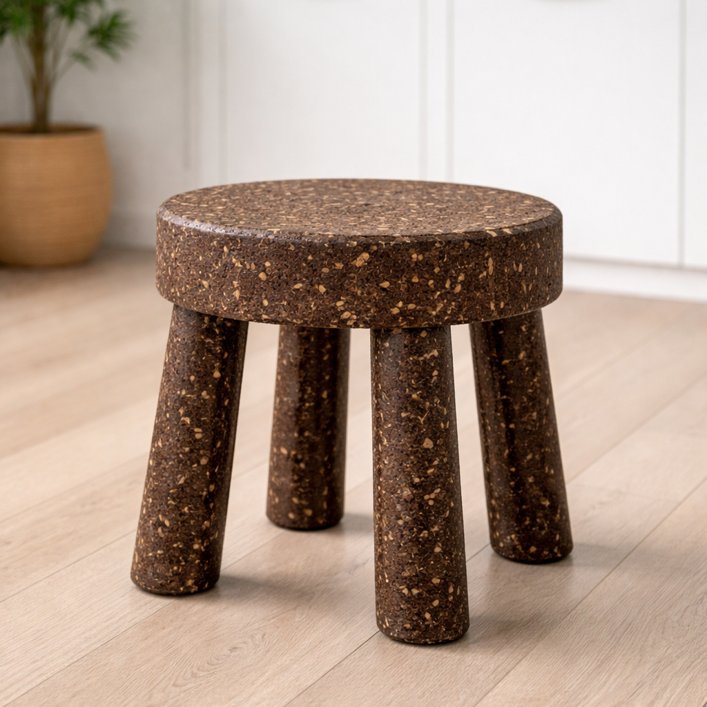

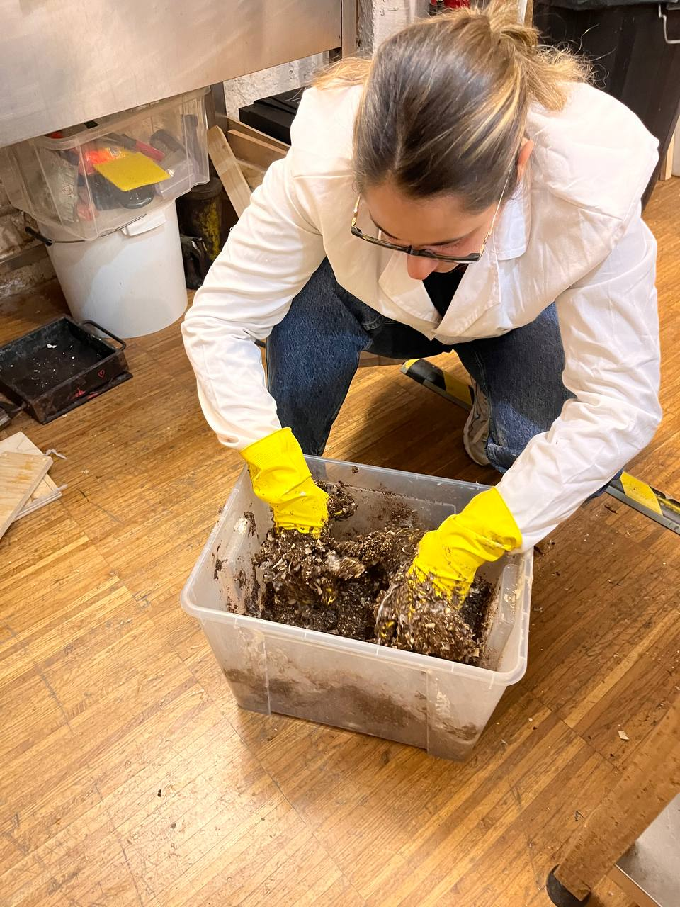

