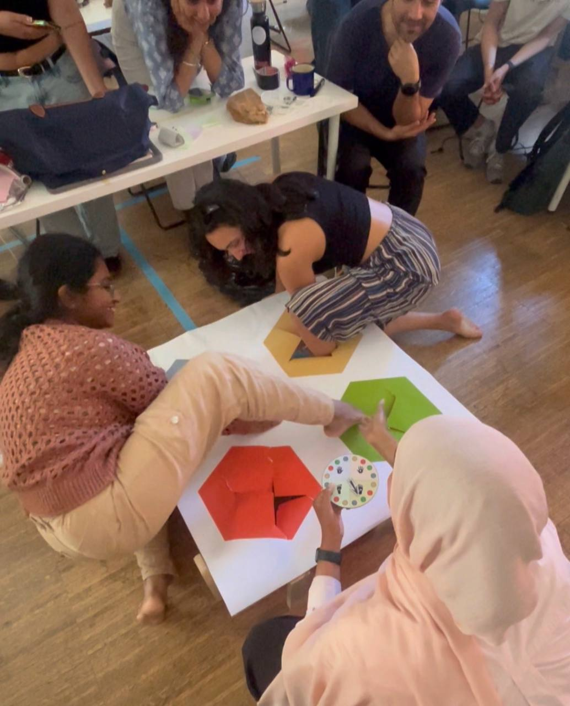
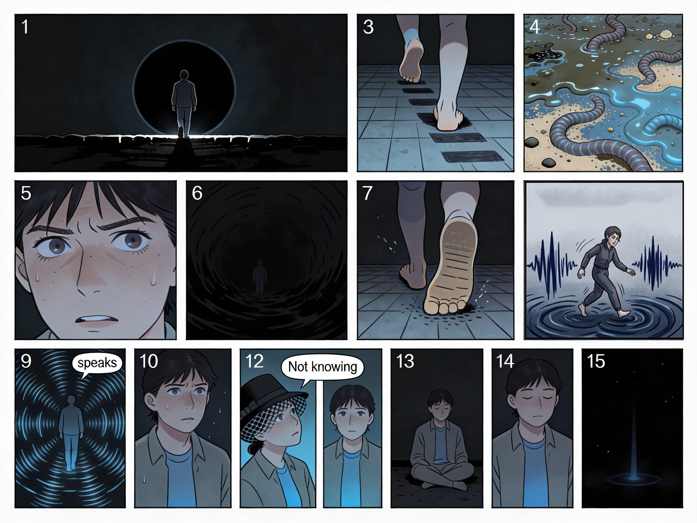
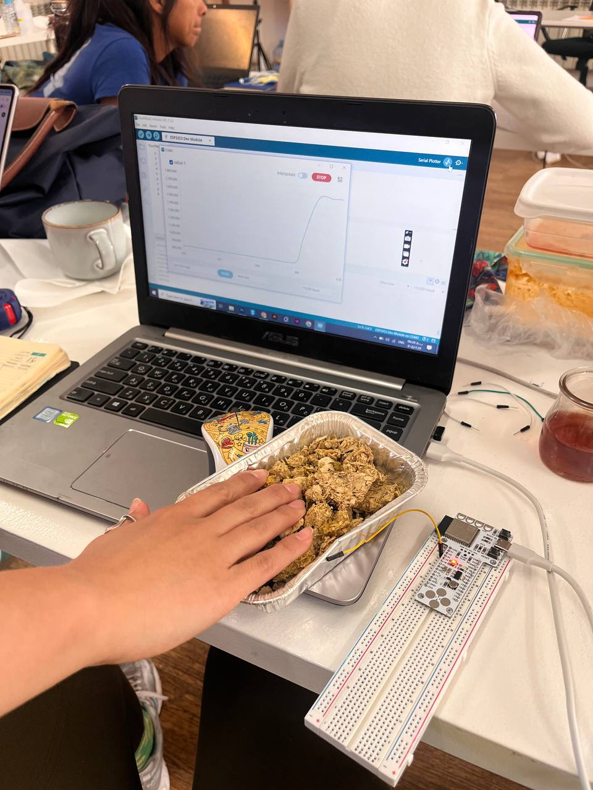
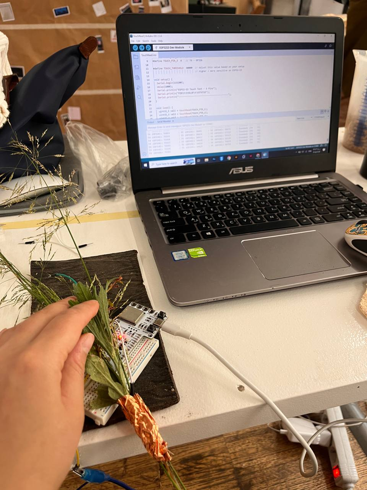
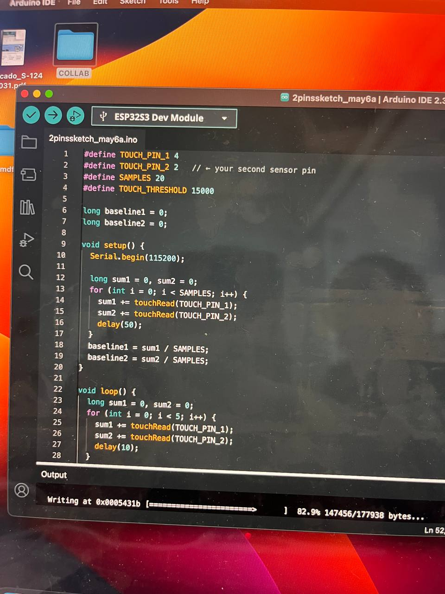
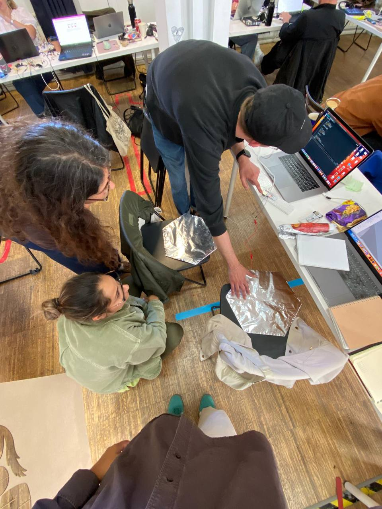
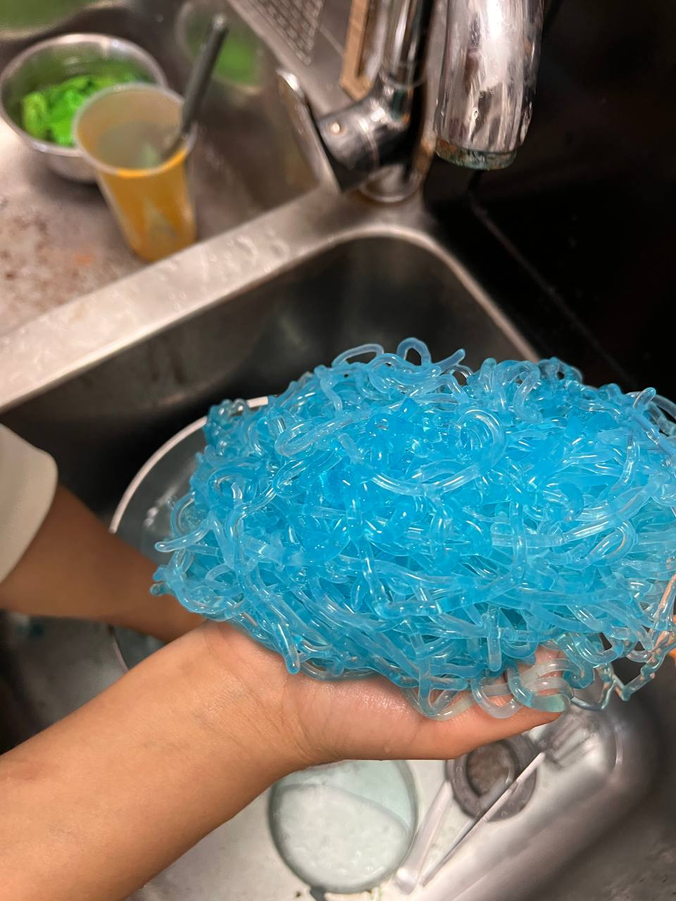
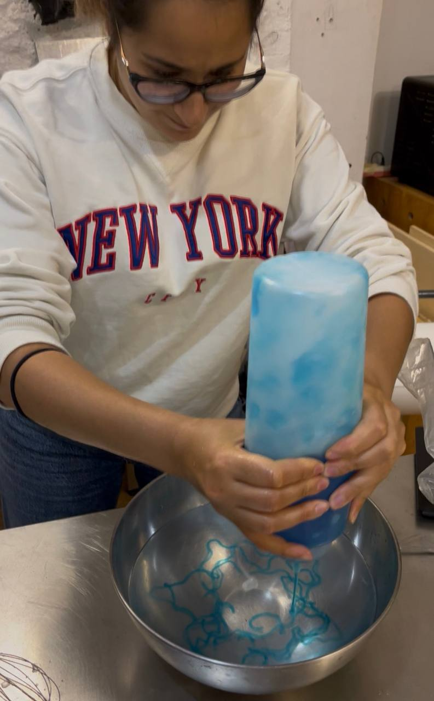
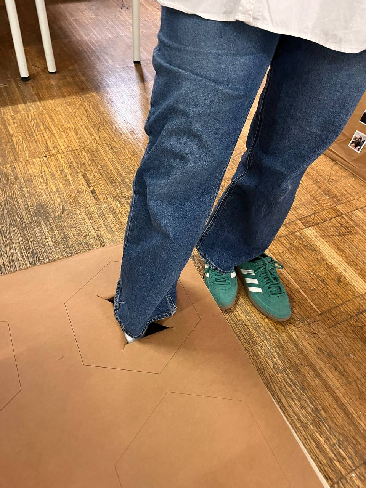

---
hide:
    - toc
---

# Sensecape

## Project Overview

Into the Void is an interactive sensory installation that explores how discomfort, perception, and emotional transformation can be experienced through touch, sound, and movement. The project was developed around a simple but fundamental idea: instead of designing an experience that immediately provides comfort, we place participants in a situation where they first encounter uncertainty and unease, and only through their own interaction and presence can they gradually construct a sense of calmness.

Rather than treating discomfort as something negative to be removed, the project frames it as an active starting point for emotional awareness. Participants are not passive receivers of comfort, they become the agents who generate it.

## Concept Development

The conceptual core of the project is based on an immersive narrative:

*You stand at the edge of a lightless void, a dark circle that swallows your vision. As you step forward, you don’t descend with your eyes, but through your feet. The initial plunge is triggering, the floor is a mystery of textures that shouldn’t exist together. Is it the slime of mud, the grit of sand, or the chilling movement of worms? This intimacy with something you’re not familiar with creates an immediate flash of irritation and anxiety.*

*As you sink deeper, the darkness forces a raw awareness of emotions. The tactile resistance beneath your soles feels like a sense of pain, a physical manifestation of remembering emotional difficulties. But then, you begin to move. You stomp, glide, and draw through the unseen medium.*

*Suddenly, the void responds. You are collaborative now, your movements sensing the floor to produce a rhythmic, haunting audio output. This sonic emotional expression begins to evoke curiosity, shifting your internal state. The “not knowing” is no longer a threat, it becomes a fascination.*

*The vibration of sound and the physical engagement with material gradually transform the experience. What begins as sensory overload evolves into grounding, stillness, and emotional clarity. You are no longer lost in the dark, you are anchored by it.*

This narrative also connects to a larger question within the project: what if discomfort is not something to eliminate, but something that allows us to actively build our own comfort? Instead of receiving comfort as a ready-made condition, the participant becomes the creator of it, through interaction, adaptation, and awareness.

## Sensory Stations and Material Exploration

The installation consists of four sensory stations, each designed with a distinct material language: sand, stone, and biomaterials such as algae, mud, and grass-like organic matter. Each material was selected to trigger a different emotional and physical response.

Sand introduces instability and unpredictability, stone creates resistance and rigidity, while the biomaterial station introduces wet, organic, and slightly unsettling sensations. These materials were intentionally chosen to blur the boundary between comfort and discomfort, encouraging participants to stay with their initial reaction long enough to discover what lies beyond it.

## Technical Development and System Design

The system was developed using a combination of physical computing and real-time audiovisual processing. Each station was equipped with capacitive sensors embedded into the tactile materials. When participants touched or interacted with these surfaces, the sensors detected the changes in capacitance and translated them into digital signals.

We used Arduino to manage and process sensor data, which was then sent into TouchDesigner for real-time audiovisual generation.

One of the most important technical challenges was working with multiple capacitive sensors simultaneously. At first, I had only worked with a single sensor connected to Arduino, which produced a simple and clear real-time value when a material was touched. However, scaling this system to four sensors introduced a completely different level of complexity.

When a single capacitive sensor is used, the output is straightforward, one continuous stream of data that changes based on touch. But when four sensors are connected at the same time, each interacting with different materials, the data structure changes significantly. Each sensor produces its own fluctuating signal, and the system must be able to distinguish, map, and stabilize these multiple inputs simultaneously. In some cases, the behavior of the data also changed depending on how many sensors were active at the same time, which made calibration and interpretation much more complex.

This part of the project became a valuable learning experience for me in Arduino coding, especially in understanding how to structure and manage multiple real-time inputs, how to avoid signal overlap, and how to ensure stable communication between hardware and software systems. It helped me move from thinking about single-input interactions to designing multi-layered sensory systems.

Another technical challenge was mapping these multiple inputs into TouchDesigner in a meaningful way. Each station needed its own audio and visual response, and all outputs had to remain coherent even when multiple participants were interacting simultaneously. Managing this level of complexity required a lot of testing, debugging, and restructuring of the data flow, but eventually the system became stable and responsive.

## Fabrication and Construction

The physical structure of the installation was built through a combination of laser cutting, woodworking, carpentry, and 3D printing. Each station was designed as a contained sensory module, hiding the electronics while allowing full focus on the tactile experience.

A significant part of the process involved testing how different materials responded to touch and how they could be integrated with sensors without losing their natural feel. The goal was to keep the technological layer invisible so that participants would engage primarily with sensation rather than the system behind it.

One of the most experimental parts of the project was developing the biomaterial station. In order to create the slimy organic texture we were looking for, I learned how to produce a simple algae-based biomaterial. I worked with concentrated algae extract and mixed it with food coloring before combining it with a water and calcium solution. This process created a viscous, organic material with a wet and unfamiliar texture that became an important sensory element within the installation.

What made this material interesting was not only its tactile quality, but also its emotional effect on participants. The texture initially felt uncomfortable and even slightly disturbing, similar to stepping into mud or wet ground in nature. However, after interacting with it for a longer period, participants often became more curious and accepting of the sensation, especially once the responsive sounds and visuals began to play.

## Design Contribution (Graphic & Interaction)

Alongside the technical and physical development, I was also responsible for the visual and graphic design direction of the project. This included designing the interactive interface and shaping the visual identity of the installation. One of my key contributions was designing the spinner element of the experience, which acted as a visual and interactive metaphor for motion, uncertainty, and emotional transition within the system.

## Personal Reflection

For me, this project redefined what design means. I have always seen design as a way to create comfort, clarity, and ease for people. But in this case, I intentionally reversed that approach. I designed something that begins with discomfort, confusion, and sensory tension, because I wanted to explore what happens when comfort is not given, but discovered.

This idea became deeply connected to my understanding of gratitude. I started to reflect on how people, myself included, often focus on negative details even in positive situations. It feels like a natural human tendency to complain or search for discomfort, even when surrounded by good things. But this project made me question that behavior: what if discomfort itself is not the problem, but actually the gateway to awareness?

Sometimes it feels like a rainy day where your clothes are wet, coffee is spilled, and everything feels unpleasant, but in the background, you still hear birds singing. That contrast changes everything. The discomfort does not disappear, but it stops being the only thing you notice.

This project also helped me grow technically in a very real way. Working with multiple capacitive sensors for the first time pushed me to understand Arduino coding at a deeper level. I learned how to read and manage multiple data streams at the same time, how sensor behavior changes when systems scale from one input to four, and how to stabilize and interpret that data correctly. It was the first time I moved beyond single-sensor logic and into multi-input interactive systems, and that shift completely changed how I think about physical computing.

On the graphic side, I also had the opportunity to contribute to the visual identity of the installation, including designing the spinner element, which helped connect the physical interaction with a clearer visual language.

In the end, this project became both a technical and personal exploration for me. It taught me that discomfort is not something to avoid at all costs, but something that can be transformed, through awareness, interaction, and design, into a space where comfort is something we actively create rather than passively receive.

