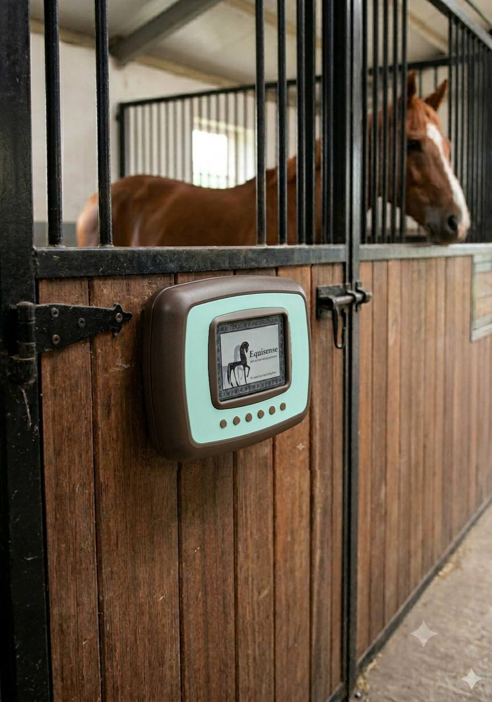
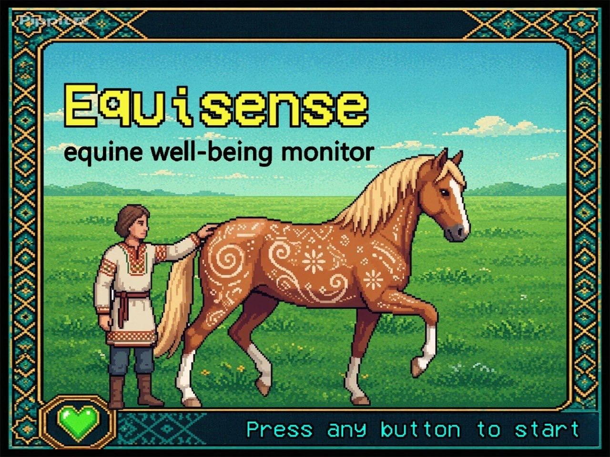
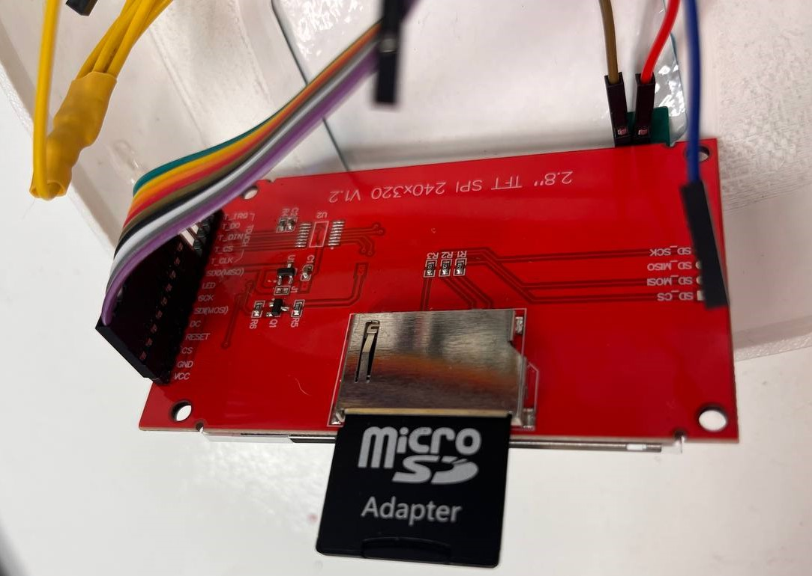
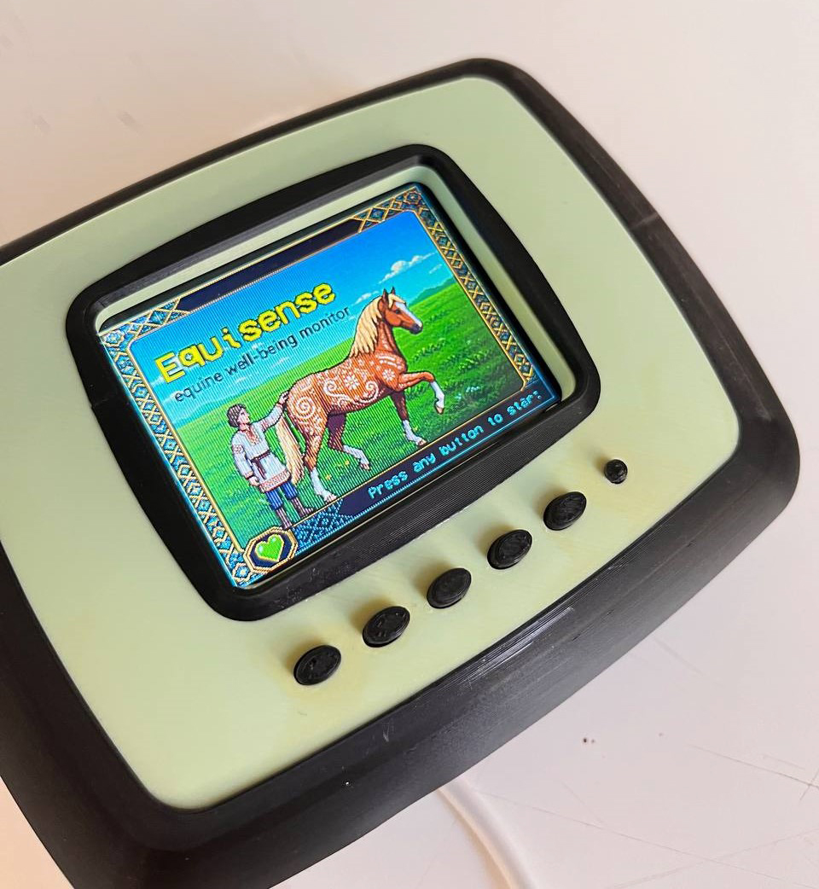

---
hide:
    - toc
---

# Equisense — Being the Voice of the Horse
- A reflection on designing for a species that cannot speak for itself.

## Where It Began
I have always been drawn to the idea that design can be an act of empathy. Not just problem-solving, not just aesthetics — but a genuine attempt to understand the experience of another being and translate that understanding into something tangible. This project gave me the opportunity to pursue that idea in a direction I had never expected: toward horses, toward equestrian sport, and toward a question that I believe matters deeply.
Horses have been part of human civilization for thousands of years. They carried us into battle, pulled our plows, moved our goods across continents, and shaped the course of history in ways we rarely stop to acknowledge. When the Industrial Revolution arrived and machines took over their labor, horses did not disappear from human life — they simply moved into a new role. Sport. Entertainment. Competition. Today, equestrian disciplines like show jumping, dressage, racing, and polo are practiced across the world, and within them exists a culture that is simultaneously beautiful and, at times, deeply troubling.
The troubling part is this: in a world where titles and performance are the currency, the horse — the actual living animal at the center of all of it — often has no voice. It cannot tell its trainer that it is exhausted. It cannot tell a rider that something hurts. It cannot signal to a competition official that it has been pushed beyond what its body can handle. Horses communicate, of course — through behavior, posture, movement, breath — but those signals require a trained and attentive eye to read, and in the pressure of competitive environments, that attention is not always available.
That gap — between what a horse is expressing and what a human is perceiving — is where this project was born.

## The Question That Drove Everything
Last semester, I began exploring this space through a different approach. I researched physical stress measurement in horses and attempted to design a wearable system that used EMG sensors attached to the horse's muscles. The idea was that muscle tension data would be translated into light patterns on a garment worn by the horse, making physical strain visible in real time. It was technically interesting, and I learned a great deal from pursuing it.
But I hit a conceptual wall. Physical sensors can tell you that a muscle is tense. They cannot tell you why. They cannot tell you whether the horse is anxious, bored, frightened, in pain, or simply alert. And in order to truly be the voice of a horse — in order to build something that actually served the animal's wellbeing — I needed to reach for emotional understanding, not just physical measurement.
This realization shifted everything. If the technology could not capture the horse's emotional state on its own, then perhaps the solution was not more sophisticated technology. Perhaps the solution was the human themselves. What if, instead of putting sensors on the horse, we gave humans a structured way to read what the horse was already showing them?
That became the concept: a system that uses human observation as its input, and translates careful, guided attention into meaningful understanding. The human becomes the sensor. The device becomes the interpreter.

## Going Into the Field
Concepts need grounding. I did not want to design in isolation, building something that looked good on paper but had no connection to the real world that horses and horse people actually inhabit. So I went to the Madrid Show Jumping competition — one of the most significant equestrian events on the international circuit and an extraordinary reference point for this work.
Being there was revelatory. I watched horses arrive, prepare, compete, and recover. I observed how riders interacted with their animals before and after rounds. I noticed the grooms — often the people who know a horse most intimately — moving quietly around them, reading them without words. And I had conversations. With riders who had spent decades in the saddle. With trainers who could tell something was wrong with a horse from across an arena. With grooms who knew their specific horse better than anyone else in the world.
What I learned from those conversations was that the knowledge exists. Experienced horse people carry an enormous amount of understanding about equine behavior — what a pinned ear means, what a tucked tail signals, what happens in the eyes and the breath and the way a horse holds its weight when it is not okay. But that knowledge is almost entirely informal. It lives in bodies and intuitions, not in systems. It is passed down through apprenticeship or developed through years of quiet observation. It is almost impossible to transfer quickly, and it is completely inaccessible to someone who is new to horses or who has not had the benefit of that kind of mentorship.
That gap — between expert intuition and accessible knowledge — became one of the central problems I wanted Equisense to address.

## What Equisense Is

Equisense is a handheld gadget that guides a user through a structured behavioral observation of a horse, then generates a response that reflects the horse's likely emotional and physical condition.
The interaction is built around 16 questions covering a range of behavioral indicators: how the horse is holding its body, how it is moving, how it is responding to touch and to people, what its appetite looks like, how it is interacting with its environment. The user answers each question using five buttons that correspond to a scale of responses. Based on the pattern of answers, the device produces one of 20 possible results — each one describing a condition and suggesting what the human should do next.
My inspiration for the interaction model was the Tamagotchi. That might sound unexpected in this context, but I think it is exactly right. What Tamagotchi understood — and what made it so enduring — was that emotional connection does not require complexity. A tiny screen, a few buttons, a simple visual language, and suddenly you feel responsible for something. You check in. You pay attention. You change your behavior based on what you see.
That is precisely what I want Equisense to do. Not to replace veterinary expertise or professional training, but to prompt a moment of genuine attention. To interrupt the pace of a competition day or a training session and ask: before you ask anything of this horse, what is it telling you?
The visual design of the device reinforces this. All 38 screens were designed by me in Adobe Illustrator as pixel art — deliberately evoking the aesthetic of the Tamagotchi while incorporating Iranian geometric patterns and motifs. The Persian design influence was important to me personally. It is part of who I am, and horses have a deep and ancient place in Persian culture and history. Weaving that visual heritage into the interface felt like the right way to honor both.

{
  "profiles": {
    "EquineWellBeingMonitor": {
      "commandName": "Project",
      "launchBrowser": true,
      "launchUrl": "https://maryamshoj.github.io/equine-well-being-monitor/"
    }
  }
}

## What I Learned About Myself
I need to be honest about something: I came into this project knowing nothing about electronics. Not a little — nothing. The idea of wiring a circuit, writing code for a microcontroller, converting illustrations into files a device could render — all of that was completely foreign to me.
And I did it anyway.
One of the most telling moments of the entire process was discovering how to solve the memory problem. After designing all 38 screens and converting them for use on the Arduino, it became clear that the device's internal storage could not hold that much image data. For a while, this felt like a wall with no door. But then I looked more carefully at the hardware already in my hands — the TFT screen itself had a small SD card slot built into its back, something I had not noticed or thought about until that moment. I converted all my images into 24-bit BMP format, organized them carefully on an SD card, slotted it into the back of the screen, and then rewrote the code from a completely different angle — teaching the Arduino to read and display images from the card rather than from its own memory. When the images finally appeared on screen exactly as I had drawn them, the feeling was unlike anything I had experienced before in a design project. It was not just satisfaction. It was disbelief that had slowly, over weeks, become belief.
That moment captures something essential about what this project gave me: the experience of not knowing how to do something, staying with that discomfort, and finding the answer inside the problem itself. The solution was already there. I just had to look carefully enough to find it.
What the process also taught me is that design at this level — physical, electronic, interactive — requires a very different kind of patience than visual or conceptual design. You cannot push through hardware problems with enthusiasm alone. You have to understand them. You have to diagnose. You have to be willing to undo hours of work because a single line of code is wrong, or because the image color depth does not match what the screen expects, or because the file order on the SD card is off by one. That methodical, investigative approach to problem-solving is something I want to carry into everything I do from here.
There is also something I want to say about working with Claude AI throughout the coding process. For someone building an electronic system for the first time, having an AI collaborator to help write, debug, and restructure code was not a shortcut — it was what made the learning possible at the pace this project demanded. I did not understand everything immediately, but I understood more each time. The code became less foreign. The errors became more readable. That progression — from confusion to comprehension — is something I am genuinely proud of.

## Why This Project Matters Beyond the Object
Equisense is a prototype. A first step. In its current form, it is a standalone device that one person can use to assess one horse in one moment. That is genuinely useful, but it is not the full vision.
The longer-term vision is a platform — an interconnected community built around horses and the people who care for them. Imagine something like The Sims, but where the characters are real horses with real histories, real personalities, and real needs. Data collected through gadgets like Equisense and through the companion website on horse body language would feed into individual horse profiles. Owners, riders, and trainers could track condition over time. Prospective buyers could read a horse's behavioral history before making decisions. People could share experiences, ask questions, flag concerns, and support one another across the knowledge gaps that currently leave so many horses unheard.
There is also something more difficult embedded in that vision: accountability. If a trainer in the real world is consistently pushing horses past their limits, a platform like this — populated by real behavioral data and real community knowledge — could make that visible. Not as surveillance, but as collective attention. The same quality of attention that Equisense asks of an individual user, scaled to a community.
Horses would, for once, be at the center. Not as objects of sport or symbols of status, but as subjects — beings with histories, emotional lives, and needs that deserve to be understood and respected.

## A Final Thought
I started this project asking whether we could be the voice of the horse. I end it believing that the voice was always there — in the way a horse lowers its head, pins its ears, shifts its weight, holds its breath. We just needed a reason to listen more carefully.
Equisense is that reason. A small device, a set of questions, a pixel-art screen with Persian patterns on its edges and an SD card in its back carrying 38 hand-drawn images. But behind it is a genuine conviction: that design can change the relationship between a human and an animal, that technology does not always need to go onto a living body to serve it, and that sometimes the most powerful thing a tool can do is simply slow a person down long enough to pay attention.
That is what I made. That is why I made it. And that, I think, is only the beginning.

